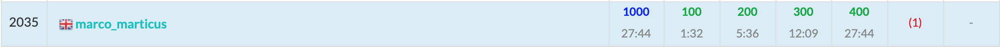

ABC182に参加しました. 結果はA~D4完$2035$位パフォーマンス$1075$. 
E問題にハマり, ダメダメでした.  



以下, A~E問題の解説およびPython解答例です.

## A - twiblr
公式解説の通り. 

```python
A, B = map(int, input().split())
N = 2 * A + 100
print(N - B)
```

## B - Almost GCD
$N \leq 100$ および $A \leq 1000$より, 全探索しても$\mathcal{O}(10^6)$なので十分に間に合う.  

```python
N = int(input())
A = list(map(int, input().split()))

max_value = 0
maxA = max(A)
for k in range(2, maxA + 1):  # k を全通り調べる
    value = sum(a % k == 0 for a in A)  # value: gcd度. 定義通りA1, A2, ... ANのうちkで割り切れるものの個数を数える
    if max_value < value:
        ans = k
        max_value = value
print(ans)
```

<adsense></adsense>

## C - To 3
中学生のときに習う(?)知識を使う. 即ち, 
  - 「整数$n$が$3$の倍数」$\Leftrightarrow$ 「$n$の各桁の数字の和が$3$の倍数」

各桁を消すかどうか、$2^k$通りをbit全探索する.  
`itertools.product`を使用すると実装が楽.  

```python
from itertools import product


N = list(map(int, list(input())))
k = len(N)

ans = k
for bit in product(range(2), repeat=k):  # 2^k を全探索
    cnt = sum(i * n for i, n in zip(bit, N))  # i: ビット(0 or 1), n: Nの桁の数字
    if cnt % 3 == 0:
        ans = min(ans, bit.count(0))

if ans == k:
    print(-1)
else:
    print(ans)
```

## D - Wandering
「累積和の累積和」を使う問題.  

 - 累積和を$S$($S_i = S_{i - 1} + A_i, \text{ただし} S_0 = 0$)とする.
 - $k$ターン目において, スタート地点$X_k$, 変位の最大値(いくつ右に移動するか)を$V_k$とすると, $k$ターン目の座標の最大値$M_k$ は $X_k + V_k$となる.  
 - ここで, $X_k, V_k$ は以下のように計算できる.
 - $X_k = S_0 + S_1 + \cdots + S_{k-1}$, すなわち$A$の**累積和の累積和**.
 - $V_k = max(S_0, S_1, \dots, S_k)$, すなわち$A$の**累積和の最大値**.


```python
from itertools import accumulate


N = int(input())
A = list(map(int, input().split()))

S = list(accumulate(A))  # S: Aの累積和
X = [0] + list(accumulate(S)) # X: iターン目のスタート地点. Aの累積和の累積和
V = list(accumulate(S, func=max))  # V: iターン目での変位の最大値

ans = max(X[i] + V[i] for i in range(N))  # X[i] + V[i]: iターン目でのx座標の最大値
print(max(0, ans))
```

<adsense></adsense>

## E - Akari

恥ずかしながら解けなかった.  
なんか難しく考えすぎて, 各行・各列ごとに電球とブロックの位置をリストに保存しておいて, あるマスから最も近い電球とブロックの位置を比較する, みたいな解き方を実装しようとしてバグが取りきれず...  

終了2分前に普通にgrid探索をすればよいことに気づいたが, 時すでに遅し...無念.  

- 各電球のマスから4方向を探索する.
- ブロックもしくは別の電球に到達した時点でその探索を終える.
- 各空きマスについては最大で上下左右方向から計4回探索が行われることになる.
- 計算量は高々$\mathcal{O}(4HW + 4N)$なので十分に間に合う.

```python
import sys
sys.setrecursionlimit(10 ** 6)

# 一方向のみ(dの方向のみ)を探索する.
# 探索を止める条件は, ブロックもしくは電球に到達した時. 
def dfs(i, j, d):  
    global H, W
    di, dj = direction[d]
    ni = i + di
    nj = j + dj
    if 0 <= ni < H and 0 <= nj < W and grid[ni][nj] == '.':
        path[ni][nj] = 1
        dfs(ni, nj, d)


H, W, N, M = map(int, input().split())
IN = sys.stdin.readlines()

grid = [['.'] * W for _ in range(H)]  # grid[i][j]: i行目j列目のマス. '.': 空き, 'L': 電球, 'B': ブロック
path = [[0] * W for _ in range(H)]  # path[i][j]: i行目j列目のマスに光が届いているかどうか.

# Light
for i in range(N):
    h, w = map(int, IN[i].split())
    h -= 1; w -= 1
    grid[h][w] = 'L'
# Block
for i in range(M):
    C, D = map(int, IN[N + i].split())
    grid[C - 1][D - 1] = 'B'


direction = [(-1, 0), (0, 1), (1, 0), (0, -1)]
for i in range(H):
    for j in range(W):
        if grid[i][j] == 'L':  # 電球が置かれている地点から探索を開始
            path[i][j] = 1
            for d in range(4):  # 4方向を探索する
                dfs(i, j, d)

cnt = 0
for l in path:
    cnt += sum(l)

print(cnt)

```

## F - Valid payments
TBA