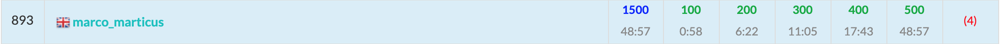

ABC183に参加しました. 結果はA~E5完$893$位パフォーマンス$1485$.   
F問題も解けそうだったんですが、`collections.Counter`の仕様の理解不足で$TLE$になってしまい撃沈。。  もったいなかった。



以下, A~F問題の解説およびPython解答例です.

## A - ReLU
DeepLearningではおなじみの$Rectified Linear Unit$関数。 
「近年のDeepLearningのブレイクスルーは本質的には$ReLU$関数の発見だけ」と言った専門家がいるとかいないとか。

```python
x = int(input())
ans = x if x >= 0 else 0
print(ans)
```

## B - Billiards

- 点$S = (x_1, y_1)$, 点$G = (x_2, y_2)$としたとき、点$S' = (x_1, -y_1)$をとり、**直線$S'G$と$x$軸の交点**が答えとなる.
- 直線$S'G$の傾きを$a = \frac{y_2 - (-y_1)}{x_2 - x_1}$とする。
- すると直線$S'G$の式は $y - (-y_1) = a(x - x_1)$と表すことができる。
- $x$軸との交点は$y = 0$を代入したときの$x$の値のため, $x = x_ 1 - \frac{(-y_1)}{a}$ である。


```python
x1, y1, x2, y2 = map(int, input().split())

a = (y2 - (-y1)) / (x2 - x1)

x = x1 - (-y1) / a
print(x)
```

<adsense></adsense>

## C - Travel
$N \leq 8$と小さいため全探索を考える。  
C問題といえば全探索。

```python
from itertools import permutations


N, K = map(int, input().split())
T = [list(map(int, input().split())) for _ in range(N)]

cnt = 0  # cnt: 移動時間がちょうどKとなる経路の数
for path in permutations(range(1, N)):
    cost = 0  # cost: 移動時間
    crt = 0  # crt: 現在地点の都市番号
    for nxt in path:
        cost += T[crt][nxt]
        crt = nxt
    cost += T[crt][0]  # 都市0に戻ってくることを忘れずに
    cnt += (cost == K)
print(cnt)
```

## D - Water Heater
`いもす法`の簡単な問題。

- 長さ $max(Ti) + 1$ の配列dpを用意して, 各$S_i, T_i, P_i$ごとに$dp[S_i]$ += $P_i$, $dp[T_i]$ -= $P_i$とする。
- 配列dpの累積和を順に計算し一度でも$W$を上回った場合は答えが'No'となる。

```python
import sys
from itertools import accumulate


N, W = map(int, input().split())
M = 2 * (10 ** 5)
dp = [0] * (M + 1)
for _ in range(N):
    s, t, p = map(int, sys.stdin.readline().split())
    dp[s] += p
    dp[t] -= p

ans = 'Yes' if max(accumulate(dp)) <= W else 'No'
print(ans)
```

<adsense></adsense>

## E - Queen on Grid

公式解説と同じ考え方で。  
 - マス$(i, j)$へ移動する方法の数 $=$    
  **縦の移動**: マス$(i - 1, j)$から移動 + マス$(i - 2, j)$から移動 + $\cdots$  
  $+$ **横の移動**: マス$(i, j - 1)$から移動 + マス$(i, j - 2)$から移動 + $\cdots$  
  $+$ **斜めの移動**: マス$(i - 1, j - 1)$から移動 + マス$(i - 2, j - 2)$から移動 + $\cdots$  
 - よって、縦・横・斜めの累積和を管理していけば計算量を落とせる。

```python
H, W = map(int, input().split())
grid = [input() for _ in range(H)]
MOD = 10 ** 9 + 7

dp = [[0] * W for _ in range(H)] # dp[i][j]: マス(i, j)に到達する方法の数
dpU = [[0] * (W + 1) for _ in range(H + 1)] # dpU: 縦方向の累積和 (Up方向)。H列目・W行目は番兵。
dpL = [[0] * (W + 1) for _ in range(H + 1)] # dpL: 横方向の累積和 (Left方向)。H列目・W行目は番兵。
dpS = [[0] * (W + 1) for _ in range(H + 1)] # dpS: 斜め方向の累積和 (Slant方向)。H列目・W行目は番兵。

dp[0][0] = 1
for i in range(H):
    for j in range(W):
        if grid[i][j] == '.':  # マス(i, j)が道のときのみ移動可能
            L = dpL[i][j - 1]  # L: 横方向からの移動方法。dp[i][j - 1]通り。
            U = dpU[i - 1][j]  # U: 縦方向からの移動方法。dp[i - 1][j]通り。
            S = dpS[i - 1][j - 1] # S: 斜め方向からの移動方法。dp[i - 1][j - 1]通り。
            
            # マス(i, j)に移動する方法の数を計算
            here = dp[i][j]
            here += L + U + S
            here %= MOD
            
            # 各セルを更新する
            dp[i][j] = here
            dpL[i][j] = (L + here) % MOD
            dpU[i][j] = (U + here) % MOD
            dpS[i][j] = (S + here) % MOD

print(dp[-1][-1])
```

## F - Confluence
`UnionFind`の変則問題。  

- $UnionFind$木を以下のように実装する。
- 親ノードは`collections.Counter`を保持する。この$Counter$で当該グループの$\text{クラス: 所属人数}$のペアを管理する。
- 子ノードは親ノードのノード番号を保持する（通常の$UnionFind$木と同じ）
- グループ同士の結合の処理(`UnionFind.union()`)では、$Counter$の項目数($len(Counter)$)を比較し**小さい方を大きい方に結合させる**（通常の$UnionFind$木の逆。通常は*大きい方を小さい方に結合させる*。)

結局これだけ？楽勝じゃん！っと思ったが、`union()`の実装でハマった。。。  
みなさんは以下の方法1~3のうちどれが計算量が少ないかわかるだろうか？  

```python
A = Counter('-省略-')
B = Counter('-省略-')

# 方法1
A += B

# 方法2
for k, v in B.items():
  A[k] += v

# 方法3
A.update(B)
```
なんと、**方法1**は$\mathcal{O}(max(len(A), len(B)))$, 他の方法では$\mathcal{O}(len(B))$なのである！(今回の経験からの個人的推測)  


というわけで今回のlessons learnedは, 

> 2つの$Counter$の結合の際は, 「+=」は厳禁！`update()`を使え！
> <cite>2020, Ma-r-co et.al.</cite>

```python
import sys
from collections import Counter


class UnionFind():
    def __init__(self, n, C):
        # 初期化処理では各ノードにCounterを持たせる
        self.parents = [Counter([C[i]]) for i in range(n)]

    def find(self, x):
        # Counterインスタンス --> そのノードは親
        # int --> そのノードは子
        if isinstance(self.parents[x], Counter):
            return x
        else:
            self.parents[x] = self.find(self.parents[x])
            return self.parents[x]

    def union(self, x, y):
        x = self.find(x)
        y = self.find(y)

        if x == y:
            return

        # 項目数が小さい方を大きい方に結合する
        if len(self.parents[x]) < len(self.parents[y]):
            x, y = y, x
        # update()を使う！！！ 超重要！！！
        self.parents[x].update(self.parents[y])
        self.parents[y] = x


N, Q = map(int, input().split())
C = list(map(int, input().split()))
query = [tuple(map(int, sys.stdin.readline().split())) for _ in range(Q)]

uf = UnionFind(N, C)

for t, *V in query:
    if t == 1:
        a, b = V
        a -= 1; b -= 1
        uf.union(a, b)
    else:
        x, y = V
        x -= 1
        print(uf.parents[uf.find(x)][y])
```

くそ〜〜全完したかった〜〜！！！
