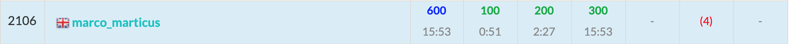

ABC183に参加しました. 結果はA~C3完$2106$位パフォーマンス$1096$.   
撃沈！！！！！ショックです！！！  
全体的に考察が易しくて実装が難しい問題が多かったような.



以下, A~F問題の解説およびPython解答例です.

## A - Determinant
定義通りに$ad - bc$を計算するだけ.  
```python
a, b = map(int, input().split())
c, d = map(int, input().split())
print(a * d - b * c)
```

## B - Quizzes
前から順に見ていくだけ.  
$X$は$0$未満にならない点に注意.  

```python
N, X = map(int, input().split())
S = input()

for s in S:
    if s == 'o':
        X += 1
    else:
        X = max(0, X - 1)
print(X)
```

<adsense></adsense>

## C - Super Ryuma
コーナーケースにハマりそうで怖い問題.  
ちなみに本番中に通した解法はAfter ContestケースでWA, つまり嘘解法だった...  

- $(r_1, c_1) \rightarrow (r_2, c_2)$の移動は, $(0, 0) \rightarrow (r_2-r_1, r_2-r_1)$への移動と等価である.  
以下, $(0, 0) \rightarrow (c, d)$への移動を考える.
- 超竜馬の移動方法は下記の3種類となる.  
$A \cdots c + d = 0$  
$B \cdots c - d = 0$  
$C \cdots abs(c) + abs(d) \leq 3$
- 移動回数が$0$回 $\cdots$  
$(c, d) = (0, 0)$ (原点が目的地の場合)
- 移動回数が$1$回 $\cdots$  
移動$A, B, C$ のどれかで到達可能な場合.
- 移動回数が$2$回 $\cdots$  
$A \rightarrow B$ もしくは $C \rightarrow A$ もしくは $C \rightarrow B$ もしくは $C \rightarrow C$ で到達可能な場合.
- 移動回数が$3$回 $\cdots$  
上記のどれにも当てはまらない場合.


```python
a, b = map(int, input().split())
c, d = map(int, input().split())

# (a, b) を原点に移動させる.
c -= a; d -= b
a, b = 0, 0

if (c, d) == (0, 0): # 0回
    ans = 0
elif abs(c) + abs(d) <= 3 or c + d == 0 or c - d == 0: # 1回
    ans = 1
elif (c + d) % 2 == 0: # A --> B で到達可能な場合. パリティが0.  
    ans = 2
elif abs(c) + abs(d) <= 6: # C --> C で到達可能な場合.
    ans = 2
else:
    # C --> A もしくは C --> Bで到達可能な場合
    for x in range(-3, 4):
        for y in range(-3, 4):
            if abs(x) + abs(y) <= 3:
                nc = c + x
                nd = d + y
                if nc + nd == 0 or nc - nd == 0:
                    ans = 2
                    break
        else:
            continue
        break
    else:
        ans = 3  # 上記いずれにも当てはまらない場合.
print(ans)

```

## D - increment of coins
dpの漸化式まではわかったが, 実装ができなかった...

- $($金貨,銀貨,銅貨$)=(a, b, c)$のときの操作回数の期待値を$dp(a,b,c)$とすると以下の漸化式が成り立つ. 
- $dp(a, b, c) = \frac{a}{a + b + c}\{dp(a + 1, b, c) + 1\} + \frac{b}{a + b + c}\{dp(a, b + 1, c) + 1\} + \frac{a}{a + b + c}\{dp(a + 1, b, c) + 1\}$
- 初期値は $a, b, c$ いずれかが$100$のとき $dp(a,b,c) = 0$ である. *操作する必要がない $\rightarrow$ 操作回数$0$.*

```python
import sys
sys.setrecursionlimit(10 ** 6)


def dfs(a, b, c):  # メモ化再帰
    if dp[a][b][c] >= 0: # 既に値がわかっている場合はそのまま返す.
        ret = dp[a][b][c]
    else:  # 値がわかっていない場合、漸化式により値を求める.
        ret = 0
        S = a + b + c
        ret += a / S * (dfs(a + 1, b, c) + 1)
        ret += b / S * (dfs(a, b + 1, c) + 1)
        ret += c / S * (dfs(a, b, c + 1) + 1)
        dp[a][b][c] = ret
    return ret


A, B, C = map(int, input().split())
M = 100
dp = [[[-1] * (M + 1) for _ in range(M + 1)] for _ in range(M + 1)]

# 初期化処理
for i in range(A, M + 1):
    for j in range(B, M + 1):
        for k in range(C, M + 1):
            if i == M or j == M or k == M:
                dp[i][j][k] = 0
# dp(A, B, C)が求める答え
print(dfs(A, B, C))
```

<adsense></adsense>

## E - Third Avenue
これはPASTで出たやつ!(:link: [第4回PAST: J - ワープ](https://atcoder.jp/contests/past202010-open/tasks/past202010_j)) と思って意気揚々とダイクストラで実装してみたが, テストケース2つだけTLEとなり通らず...  

Pythonはheapqが本当に遅い...(まあ自分の能力が足りないだけです...)  
というわけで以下は解説の通りのBFS解法.  

- まず, 各文字についてワープは最大1回しか行わない. なぜなら, 2回ワープする場合は最初から2回目の出口にいく方がコストが低いため.
- マス'.'からは上下左右4方向に移動する.
- マス'a'~'z'からは初めてその文字に訪れた場合はワープと上下左右への移動を行い, 2回目以降は上下左右のみの移動をする.
- よって計算量は高々, 上下左右移動: $\mathcal{O}(4HW)$ + ワープ: $\mathcal{O}(26HW)$ 程度で十分間に合う. 実際はワープの量がもっと少ない.  

```python
from collections import deque


H, W = map(int, input().split())
A = [input() for _ in range(H)]
WARP = [[] for _ in range(26)]  # WARP[c]: 文字cのマスの座標
for i in range(H):  # まずスタート、ゴール、ワープの位置を調べる.
    for j in range(W):
        a = A[i][j]
        if a == 'S':
            S = (i, j)
        elif a == 'G':
            G = (i, j)
        elif a != '#' and a != '.':
            c = ord(a) - ord('a')
            WARP[c].append((i, j))

INF = float('inf')
path = [[INF] * W for _ in range(H)]  # path[i][j]: マス(i, j)へ移動する最小コスト
path_IN = [-1] * 26  # path_IN[c]: 文字cのワープを実施済かどうかを管理する

q = deque()
q.append((0, S))
path[S[0]][S[1]] = 0
d = ((1, 0), (-1, 0), (0, 1), (0, -1))  # d: 上下左右方向の移動
while q:
    cost, (i, j) = q.popleft()
    # まず上下左右への移動を行う
    for di, dj in d:
        ni = i + di
        nj = j + dj
        if 0 <= ni < H and 0 <= nj < W and A[ni][nj] != '#' and path[ni][nj] > cost + 1:
            path[ni][nj] = cost + 1
            q.append((cost + 1, (ni, nj)))
    # 文字a~zのマスに初めて訪れた場合はワープを行う
    a = ord(A[i][j]) - ord('a')
    if 0 <= a <= 25 and path_IN[a] == -1:
        path_IN[a] = cost + 1
        for ni, nj in WARP[a]:
            if path[ni][nj] >= cost + 1:
                q.append((cost + 1, (ni, nj)))

ans = path[G[0]][G[1]]
if ans == INF:
    print(-1)
else:
    print(ans)
```

<adsense></adsense>

## F - Programming Contest
コンテストで半分全列挙の問題をみたのは初めて.  
D ~ Fの中では一番実装が素直な感じがする.  

以下、二分探索を使用した解法.

```python
from bisect import bisect_right


N, T = map(int, input().split())
A = list(map(int, input().split()))

# Aを20個ずつにわけて、それぞれのグループで和の取り得る値を全列挙する.
# X: 前半20個のグループ(N <= 20のときはXのみ)
# Y: 後半20個のグループ(N <= 20のときはY={0}のみ)
nx = min(N, 20)  # nx: Xグループの要素数
X = set([0])  # X: Xグループの和の取り得る値
for i in range(nx):
    nX = set()
    a = A[i]
    for x in X:
        nX.add(x)
        nX.add(x + a)
    X = nX
ny = max(0, N - nx) # ny: Yグループの要素数
Y = set([0])  # Y: Yグループの和の取り得る値
for j in range(ny):
    nY = set()
    a = A[nx + j]  # nx番目〜(nx+ny)番目まで.
    for y in Y:
        nY.add(y)
        nY.add(y + a)
    Y = nY

X = sorted(list(X))  # 昇順にソートする
Y = sorted(list(Y))

ans = 0
j = 0
for x in reversed(X):  # Xグループの各項xについて, x + y が最もTに近くなるYグループの項yを求める.
    if x <= T:  # x > T のときはそもそも対象外 
        j = bisect_right(Y, T - x, lo=j)  # T - x に最も近い値を求める. loを指定することで探索範囲を狭める.
        y = Y[j - 1]
        ans = max(ans, x + y)
print(ans)
```

## まとめ
ABC3完なんて半年以上経験していない。。。まじでショックだ。。  
次回に向けて精進します。
