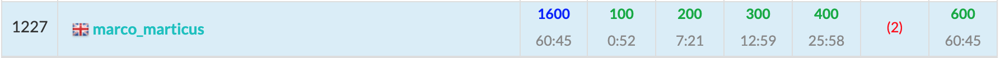

ABC185に参加しました. 結果はA~D,F$5$完$1227$位パフォーマンス$1356$.   
E問題以外は普段よりも簡単だったと思います。



以下, A~F問題の解説およびPython解答例です.

## A - ABC Preparation
$A_1, A_2, A_3, A_4$の最小値が答え。  
Pythonであればワンライナーで書ける。
```python
print(min(map(int, input().split())))
```

## B - Smartphone Addiction
各カフェに**到着した時**と**出発する時**それぞれのバッテリー残量を計算し、一度でも$0$以下になったら答えは**No**。
 

```python
N, M, T = map(int, input().split())
C = [tuple(map(int, input().split())) for _ in range(M)]
C.append((T, T))  # 時刻Tに自宅に到着する 

t = 0  # t: 現在時刻
battery = N  # battery: バッテリー残量
res = True # res: 0以下になるかどうか
for a, b in C:
    battery -= a - t
    res &= (battery > 0)
    battery = min(N, battery + b - a)
    res &= (battery > 0)
    t = b
ans = 'Yes' if res else 'No'
print(ans)
```

<adsense></adsense>

## C - Duodecim Ferra
- この問題は「$L$個のボールを$12$個の区別された箱に入れる(ただし各箱に最低1個)」の場合の数と等しい。  
- 各箱に最初に1個ずつボールを入れておくことにすれば、「$L - 12$個のボールを$12$個の区別された箱に入れる」場合の数となる。
- すなわち, ${}_{L - 12 + 11} \mathrm{C}_{11} = {}_{L - 1} \mathrm{C}_{11}$


```python
from math import factorial


L = int(input())
print(factorial(L - 1) // factorial(L - 12) // factorial(11))
```

## D - Stamp
- マス目全体を$M$個の青マスによって$M+1$個の領域に分けることができる。
- 各領域の白マスの個数を$B_i$とする。なお, $B_0$は$A_1$の左側の領域、$B_M$は$A_M$の右側の領域である。
- $B_i$がすべて$0$のときは, 全体が青色になっているため答えは$0$。
- $B_i$に$0$以外が含まれているとき, $0$を除いた最小値を$k$とすると、スタンプの大きさは$k$である。
- そして, 各領域でスタンプを押す回数は $\lceil \frac{B_i}{k} \rceil$ で求めることができる。
- ただし、$M = 0$のときは例外で、答えは必ず$1$である。

```python
N, M = map(int, input().split())
A = list(map(lambda x: int(x) - 1, input().split()))

if M == 0:  # M == 0のときは例外
    ans = 1
else:
    A.sort()
    B = [0] * (M + 1)  # Bi: 各領域の白マスの個数
    B[0] = A[0] - 0
    for i in range(1, M):
        B[i] = A[i] - A[i - 1] - 1
    B[M] = (N - 1) - A[M - 1]

    if all(b == 0 for b in B):  # 白マスが存在しない場合は答えは0
        ans = 0
    else:
        k = min(b for b in B if b != 0)  # k: 0を除いたBiの最小値 (= スタンプの大きさ)
        ans = sum((b + k - 1) // k for b in B)
print(ans)
```

<adsense></adsense>

## E - Sequence Matching
解説AC。

最長共通部分文字列(LCS: Longest Common Subsequence)の類題か。

- $dp[i][j] :=$ $A$の$i$文字目, $B$の$j$文字目までで$A', B'$を作った場合のコストの最小値 とする。
- $(i, j)$では以下の3種類の操作ができる。  
1.$A_i, B_j$を両方とも残す  
2.$A_i$を消す  
3.$B_j$を消す  
- このとき、それぞれ以下のコストを要する。  
1.$A_i == B_j$のときは$0$、そうでないときは$1$。  
2.1文字削除するため$1$  
3.1文字削除するため$1$  
- したがって、遷移式は以下のようになる  
1.$dp[i][j] \leftarrow dp[i - 1][j - 1] + (A_i$ != $B_j)$  
2.$dp[i][j] \leftarrow dp[i - 1][j] + 1$  
3.$dp[i][j] \leftarrow dp[i][j - 1] + 1$  


```python
N, M = map(int, input().split())
A = list(map(int, input().split()))
B = list(map(int, input().split()))
LA = len(A)
LB = len(B)

INF = float('inf')
dp = [[INF] * (LB + 1) for _ in range(LA + 1)]
dp[0][0] = 0
for i in range(LA + 1):
    for j in range(LB + 1):
        here = dp[i][j]
        if i > 0 and j > 0:
            here = min(here, dp[i - 1][j - 1] + (A[i - 1] != B[j - 1]))
        here = min(here, dp[i - 1][j] + 1)
        here = min(here, dp[i][j - 1] + 1)
        dp[i][j] = here
print(dp[LA][LB])
```

<adsense></adsense>

## F - Range Xor Query
過去最易のF問題と思われる。  
これがE問題だったらDifficultyが茶色になってたんじゃないかな。

単純な「1点更新, 区間取得」のためSegmentTreeで解ける。

```python
from operator import xor
import sys


class SegmentTree():
    def __init__(self, A, dot, e):
        """
        Parameters
        ----------
        A : list
            対象の配列
        dot :
            Segment function
        e : int
            単位元
        """
        # 省略
    
    def update(self, i, c):
        # 省略
    def get(self, l, r):
        # 省略


N, Q = map(int, input().split())
A = list(map(int, input().split()))
st = SegmentTree(A, xor, 0)
ans = []
for i in range(Q):
    t, x, y = map(int, sys.stdin.readline().split())
    x -= 1
    if t == 1:
        st.update(x, y)
    else:
        cnt = st.get(x, y + 1)
        ans.append(cnt)
print(*ans, sep='\n')
```

## まとめ
今の実力ではE問題は解けなかったな。。  
最近はコンテスト中に水色Diffが解けることが少なくなってきた。