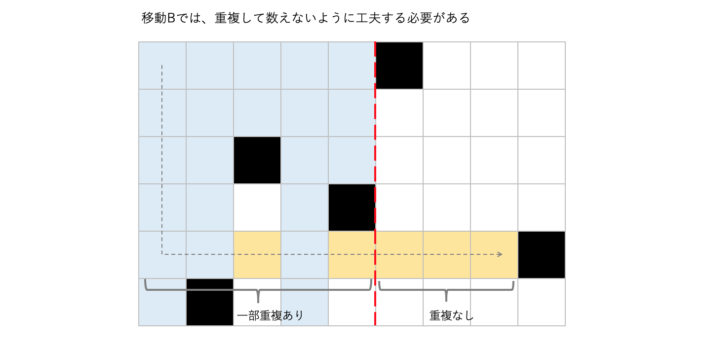

パナソニックプログラミングコンテスト(ABC185)に参加しました。結果は4完2023位パフォーマンス1017. 
ここ1~2ヶ月本当に成績が悪い。。。  

以下, A~F問題の解説およびPython解答例です.

## A - Brick
```python
N, W = map(int, input().split())
print(N // W)
```

## B - Blocks on Grid
グリッド全体の最小値に揃えるのが最適となるため, 最小値を$k$とすると,  
$A_{ij}\text{の総和} - k * H * W$  
が答えとなる。


```python
H, W = map(int, input().split())
A = [list(map(int, input().split())) for _ in range(H)]

k = float('inf')
S = 0
for row in A:
    k = min(k, min(row))
    S += sum(row)

print(S - k * H * W)
```

<adsense></adsense>

## C - Unlucky 7
「$8$進表記」「$10$進表記」それぞれで$7$が含まるどうかを愚直にチェックする

```python
def check(n, m):
    ''' n を m 進表記 したときに7が含まれるか調べる
    '''
    while n > 0:
        if n % m == 7:
            return False
        n //= m
    return True


N = int(input())
cnt = 0
for n in range(1, N + 1):
    if check(n, 8) and check(n, 10):
        cnt += 1
print(cnt)
```

## D - Sum of difference

- $A$をソートして $A_1\leq\cdots\leq A_N$とする。
- このとき $i\lt j$ に対して $|A_i-A_j| = A_j-A_i$ が成り立つ。
- すると, 各$i$について  
$\sum_{j=i+1}^{N}|A_i-A_j|$  
$= (A_{i+1} - A_i) + (A_{i+2} - A_i) + \cdots + (A_N - A_i)$  
$= (A_{i+1} + A_{i+2} + \cdots + A_N) - (A_i + A_i + \cdots + A_i)$  
$= (\sum_{j=i+1}^{N}A_j)-(N-i)A_i$  
となる。
- よって、累積和を用いれば上記が$\mathcal{O}(1)$で求められる。

```python
from itertools import accumulate


N = int(input())
A = list(map(int, input().split()))
A.sort()
S = list(accumulate(A))

ans = 0
for i, a in enumerate(A):
    s = S[N - 1] - S[i]
    r = N - (i + 1)
    ans += s - r * a
print(ans)
```

<adsense></adsense>

## E - Throne
解説AC。

- $S + Kx \equiv 0 \pmod{N}$ を満たす最小の非負整数 $x$ を求める問題。
- $d = gcd(N, S, K)$  
$n = N$ // $d$  
$s = S$ // $d$  
$K = k$ // $d$  
とすると、
- $S + Kx \equiv 0 \pmod{N}$  
$\Leftrightarrow s + kx \equiv 0 \pmod{n}$  
$\Leftrightarrow kx \equiv -s \pmod{n}$
- ここで、$k$ と $n$ が互いに素であれば $k$ の逆元が存在する。([参考](https://ja.wikipedia.org/wiki/%E3%83%A2%E3%82%B8%E3%83%A5%E3%83%A9%E9%80%86%E6%95%B0))
- よって、$x \equiv -s * k^{-1} \pmod{n}$ と $x$ が求まる。
- なお逆元はPythonであれば $k^{-1} = pow(k, -1, n)$ で簡単に得られる。

```python
from math import gcd


T = int(input())
query = [tuple(map(int, input().split())) for _ in range(T)]
for (N, S, K) in query:
    d = gcd(gcd(N, S), K)
    n, s, k = N // d, S // d, K // d
    if gcd(k, n) == 1:  # k と n が互いに素である場合のみ解が存在する
        x = pow(k, -1, n) * (-s)  # pow関数により逆元を求める
        x %= n
    else:
        x = -1
    print(x)
```

<adsense></adsense>

## F - Rook on Grid
解説AC。

- 移動は下記の2種類が考えられる:  
移動$A$: 右に移動 $\rightarrow$ 下に移動  
移動$B$: 下に移動 $\rightarrow$ 右に移動
- まず移動$A$で到達可能なマスを数え上げる。これは各列で最も上にある障害物の位置がわかっていれば、$\mathcal{O}(W)$で求められる。
- 次に、移動$B$で到達可能なマスを数え上げるのだが、移動$A$で既に数えたマスを含めないように注意する。
- 下図のように、重複が存在する区間では、自身より上に障害物が存在しているマスのみを数えるようにする。実装上は、各行を上から順番に処理していき、SegmentTreeを使って障害物が登場した列の数を管理する。



```python
import sys


class SegmentTree():
    def __init__(self, A, dot, e):
        """
        Parameters
        ----------
        A : list
            対象の配列
        dot :
            Segment function
        e : int
            単位元
        """
        # 省略
    
    def update(self, i, c):
        # 省略
    def get(self, l, r):
        """ 区間[l, r) の集計値を返す
        """
        # 省略


H, W, M = map(int, input().split())
obs = [tuple(map(lambda x: int(x) - 1, sys.stdin.readline().split())) for _ in range(M)]
LH = [[W] for _ in range(H)]  # LH[i]: 行i に存在する障害物の位置j。番兵 W を初期値として挿入している。
LW = [[H] for _ in range(W)]  # LW[j]: 列j に存在する障害物の位置i。番兵 H を初期値として挿入している。
for x, y in obs:
    LH[x].append(y)
    LW[y].append(x)
for i in range(H):
    LH[i].sort()
for j in range(W):
    LW[j].sort()

hmax = LW[0][0]  # hmax: 下→右 と移動するとき、下にどこまでいけるか
wmax = LH[0][0]  # wmax: 右→下 と移動するとき、右にどこまでいけるか

ans = 0

# 移動A(右→下)の数え上げ
for w in range(wmax):
    cnt = LW[w][0]
    ans += cnt

# 移動B(下→右)の数え上げ
st = SegmentTree([0] * W, add, 0)
for h in range(hmax):
    r = LH[h][0]
    if r <= wmax:  # wmaxに到達しない時
        cnt = st.get(0, r)
    else:  # wmaxに到達する時、重複が存在する区間・しない区間で別々に数える
        cnt = st.get(0, wmax) + (r - wmax)
    ans += cnt
    for w in LH[h]: # SegmentTreeを更新
        if w != W:
            st.update(w, 1)

print(ans)
```

## まとめ
うーん、F問題に注力していれば解けたかなあ。。。（たられば）
