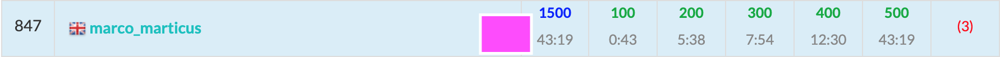

ABC169に参加しました。  
結果は5完846位でパフォーマンス1643。まずはレートが下がらなくて一安心。  
オーバーフローや桁精度などPython有利な回だった。(といっても、中上位層にはほとんど関係ないでしょうが、、、)



## A - Multiplication 1
A史上最易では？
```python
A, B = map(int, input().split())
print(A * B)
```

## B - Multiplication 2
B問題で$10^5$オーダーってなかなか無いんじゃないかな。  
この問題にけっこう時間かかってしまった。
```python
N = int(input())
A = list(map(int, input().split()))
INF = 10 ** 18

# 0が含まれるケースを先に切り分ける
# ソートして最初の要素が0かどうかで判定
A.sort()
if A[0] == 0:
    print(0)
    exit()

cnt = 1
for a in A:
    cnt *= a
    if cnt > INF:
        print(-1)
        exit()
print(cnt)
```

## C - Multiplication 3
Pythonなら「"精度"が効いてくる問題=`Decimal`」って脊髄反射してもいいくらいかと。  
なお、`Decimal`型は計算精度を任意に変えられるが、デフォルトでは28桁で競プロでは意識して調整する必要がない十分な精度。

> decimal モジュールでは計算精度をユーザが変更できます(デフォルトでは 28 桁です)。  
> <cite>[Python 3.8.3 ドキュメント](https://docs.python.org/ja/3/library/decimal.html)</cite>

```python
from decimal import Decimal
A, B = map(Decimal, input().split())
print(int(A * B))
```

## D - Div Game
素因数分解の典型問題。数え上げのロジックはすぐに思いつくだろうが、実装が少し難しいか。

```python
# 素因分解をする関数
# Counter{素数: 個数}を返す
def factorization(n):
    from collections import Counter
    arr = Counter()
    temp = n
    for i in range(2, int(n**0.5) + 1):
        if temp % i == 0:
            cnt = 0
            while temp % i == 0:
                cnt += 1
                temp //= i
            arr[i] = cnt

    if temp != 1:
        arr[temp] = 1

    if len(arr.keys()) == 0 and n != 1:
        arr[n] = 1

    return arr


N = int(input())

primes = factorization(N)

cnt = 0
for p, n in primes.items(): # ここではpを使わないので、values()の方が適切
    k = 1
    while n >= k:
        cnt += 1
        n -= k
        k += 1
print(cnt)
```

## E - Count Median
中央値の上限・下限が求められることには気づいたが、その間の数がすべて取り得るかどうかが直感的に疑わしかった。
とりあえず実装して提出してみたら一発AC。ラッキーでした。

```python
N = int(input())
X = [tuple(map(int, input().split())) for _ in range(N)]

# 中央値となるインデックスを求める
# Nが奇数の場合は n0 = n1 とすることで対応可能
if N % 2 == 0:
    n0 = N // 2 - 1
    n1 = n0 + 1
else:
    n0 = (N + 1) // 2 - 1
    n1 = n0

# Aの順でソート 
# 中央値の下限を求める
X.sort()
l0 = X[n0][0]
l1 = X[n1][0]
Ls, Lt = divmod(l0 + l1, 2)  # Lt := 下限がx.5かどうか。

# Aの順でソート 
# 中央値の上限を求める
X.sort(key=lambda x: x[1])
r0 = X[n0][1]
r1 = X[n1][1]
Rs, Rt = divmod(r0 + r1, 2) # Rt := 上限がx.5かどうか

e = 2 if N % 2 == 0 else 1  # Nが偶数の場合0.5刻み
d = (Rs - Ls) * e + 1
cnt = d
cnt -= (Lt == 1)
cnt += (Rt == 1)
print(cnt)
```

## F - Knapsack for All Subsets
脊髄反射的にDPを実装したが$O(N^2S)$ になり間に合わず。無念。