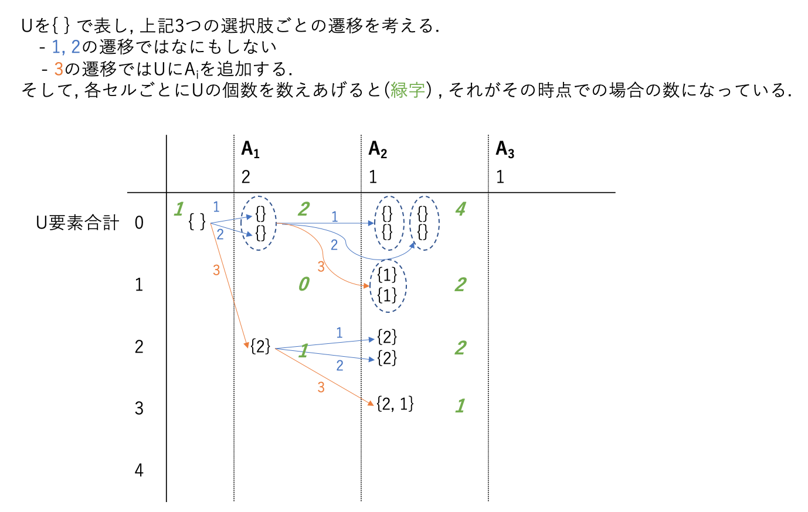

ABC169 F問題, コンテスト中には解けなかったので解説AC.  
考察:難, 実装:易の問題ですね.

## 問題
問題ページは[こちら](https://atcoder.jp/contests/abc169/tasks/abc169_f)

### 題意
公式解説より引用.
>$\{1, 2,...,N\}$の空でない部分集合$(T, U)$の組であって以下の条件を満たすものは何通りありますか？  
>$1. T\supseteq U$  
>$2. U=\{x_1, x_2,...,x_k\}とするとa_{x_1}+a_{x_2}+\cdots+a_{x_k}=S$

## 考え方
### 各$A_i$について3つの選択肢がある
普通のナップサック問題であれば「ナップサックに入れる/入れない」の2つの選択肢だけだが, 本問では以下の3つの選択肢がある.
1. TにもUにも入れない  
2. Tに入れるが, Uに入れない
3. Uに入れる

これらを$A$の左から順に場合分けして数え上げていくと, 以下のような遷移をすることがわかる.


ポイントは, スタート $\rightarrow A_1$ と $A_1 \rightarrow A_2$ の遷移が独立となっている点である. つまり, 例えば$A_1 \rightarrow A_2$を見ると$A_1$のすべての$\{\}$から3通りすべての遷移が行われている.  
この性質によりdpで解くことができる.


## 解答
以上の考察により, 結局は典型的なDP問題に帰着する.

```python
# pypyでないとTLE
N, S = map(int, input().split())
A = list(map(int, input().split()))

MOD = 998244353

# dp[i][j] := i番目までの遷移をして, Uの要素の和が j であるような場合の数
dp = [[0] * (S + 1) for _ in range(N + 1)]
dp[0][0] = 1

for i in range(N):
    ai = A[i]
    for j in range(S + 1):
        here = dp[i][j]

        # 1. TにもUにも入れない
        dp[i + 1][j] += here

        # 2. Tに入れるが, Uに入れない
        dp[i + 1][j] += here

        dp[i + 1][j] %= MOD

        # 3. Uに入れる
        if j + ai <= S:
            dp[i + 1][j + ai] += here
            dp[i + 1][j + ai] %= MOD

# 答えは, N番目まで見終わったときにUの合計=Sとなっている場合の数
print(dp[N][S])
```

なお, この問題では $i\rightarrow i+1$ の遷移しか無いため, dp配列を1次元で持つことができる.  当然こちらの方が速い.
```python
# pypyでないとTLE
N, S = map(int, input().split())
A = list(map(int, input().split()))

MOD = 998244353

dp = [0] * (S + 1) b  # DP配列は1次元
dp[0] = 1

for i in range(N):
    ai = A[i]
    for j in range(S, -1, -1): # 重複して数え上げないように大きい方からループする
        dp[j] = (2 * dp[j] + (j - ai >= 0) * dp[j - ai]) % MOD
 
print(dp[S])
```