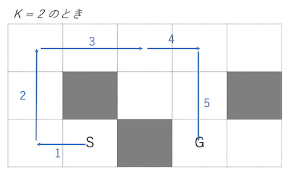

ABC170 F問題がとても勉強になったのでメモ.

## 問題
問題ページは[こちら](https://atcoder.jp/contests/abc170/tasks/abc170_f)

### 題意
グリッド上の最短経路問題. 
通常の最短経路問題では1回の移動で1マス進むだけだが, 本問では1回の移動で同一方向1マス以上Kマス以下の好きなマスに止まることができる.  



## 考え方
以下の3つの考え方がポイントとなる.
1. 最短距離配列は各マスごとに上下左右4つの状態を持つ
2. 向きを変えるときにもコストを加える
3. コストは(移動回数, 同一移動の進行済マス数)というペアで持つ


### 1. 最短距離配列は各マスごとに上下左右4つの状態を持つ
最短距離配列(僕の解答では`path`としている)は各マスごとに上下左右という4つの状態を持たせる.  
ある状態からの遷移先は, 同一マスの違う向き or 同一方向の次のマス の計4箇所となる.


実装の際は, 0~4を上・右・下・左に割り当てて, 長さ4のリストで持てば良い.
```python
# 参考実装
INF = float('inf')
path = [[[INF] * 4 for _ in range(W)] for _ in range(H)]
```

### 2. 向きを変えるときにコストを加える
通常の最短経路問題では**次のマスに進むとき**にコストを加えるが, 本問では**向きを変えるときにコストを加える**という考え方がポイントとなる.  

簡単のため $K = \infty$ として説明する.  
将棋でいう香車と似た動きができる. 一度進み始めればどこまでも進めるが, 違う方向に進みたいときは向きを変える必要がある.  
向きを変えるときにコストが$+1$されると考えることで解くことができる.

下図では向きを変えるたびにコストを+1している. コストの合計がその経路の移動回数と等しくなっていることがわかる.


### 3. コストは(移動回数, 同一方向の進行済マス数)というペアで持つ
$K = \infty$のときは「向き変更の回数 = 移動回数」であった. しかし, $K$が有限のときにはこの関係が成り立たないことは直感的にわかると思う. 1回の移動で進めるマス数に制限(最大$K$マス)が存在するためだ.  
この制限を考慮に入れるため, コストを(移動回数, 同一方向への進行済マス数)というタプルで考える.

このコストの第1要素を$1^{st}$, 第２要素を$2^{nd}$と呼ぶことにする.
すると, 向きを変えるとき$1^{st}$が$+1$され, 直進するとき(すなわち同一方向に進む)とき$2^{nd}$が$+1$される.


すると, このペアは**全順序**となるため, `Python`のタプルと同じ大小関係を持つ. すなわち,
  1. $\forall a,b\quad x < y \Rightarrow(x, a)<(y, b)$
  2. $\forall a\quad x < y \Rightarrow(a, x)<(a, y)$

この性質により, bfsでの最短距離判定の際に単純な大小比較で実装できる.

## 解答
以上の考え方を使い, 01BFSで最短経路を求める.  
答えはゴール地点での$1^{st}$の最小値である. 同一方向に進むときは$1^{st}$が増えないためキューの先頭に挿入. 向きを変える or 進行済マス数=＝K のときは$1^{st}$が増えるためキューの最後尾に挿入する.

```python
from collections import deque


H, W, K = map(int, input().split())
x1, y1, x2, y2 = map(lambda x: int(x) - 1, input().split())
grid = [input() for _ in range(H)]

INF = float('inf')
path = [[[(INF, INF)] * 4 for _ in range(W)] for _ in range(H)]

D = [(-1, 0), (0, 1), (1, 0), (0, -1)] # 上:0, 右:1, 下:2, 左:3

# 初期処理
q = deque()
for d in range(4):
    path[x1][y1][d] = (1, 0)  # スタート地点では(1, 0)
    q.append((x1, y1, d, 1, 0)) # (x, y, 進行方向[d], 移動回数[c], 進行済マス数[k])

# 01BFS
while q:
    x, y, d, c, k = q.popleft()

    # nx, ny: 次の座標
    # nd: 次の進行方向
    # nc: 次の移動回数
    # nk: 次の進行済マス数
    for nd in range(4):
        if nd == d:
            dx, dy = D[nd]
            nk = 1 if k == K else k + 1
            nc = c + 1 if k == K else c
        else:
            dx, dy = 0, 0
            nk = 0
            nc = c + 1
        nx = x + dx; ny = y + dy
        if 0 <= nx < H and 0 <= ny < W and grid[nx][ny] == '.' and path[nx][ny][nd] > (nc, nk):
            path[nx][ny][nd] = (nc, nk)
            if nc == c:
                q.appendleft((nx, ny, nd, nc, nk))
            else:
                q.append((nx, ny, nd, nc, nk))

# ゴール地点の最小コストを求める
ans = INF
for d in range(4):
    ans = min(ans, path[x2][y2][d][0])
ans = -1 if ans == INF else ans
print(ans)
```

## 補記
想定解答では, コストの持たせ方の考えをさらに推し進めて**分数**として考えている.  
$(c, k)\rightarrow c\frac{k}{K}$
