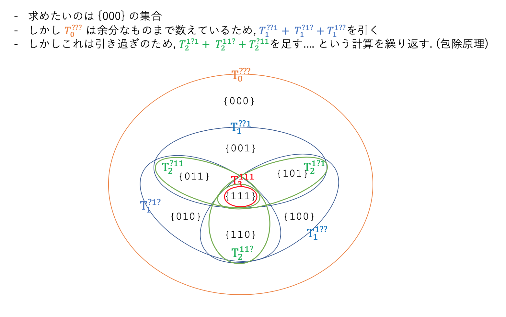

ABC172に参加しました. 
結果は4完755thでパフォーマンス1643.. 早解きに助けれらました.


## A - Calc
```python
a = int(input())
print(a + a ** 2 + a ** 3)
```

## B - Minor Change
愚直にfor文で1文字ずつ比較.

```python
S = input()
T = input()
cnt = 0
for i in range(len(S)):
    cnt += (S[i] != T[i])

print(cnt)
```

Pythonicにやるなら下記のようにワンライナーでOK.
```python
print(sum(s != t for s, t in zip(input(), input())))
```

## C - Tsundoku
けっこう難しかった.  
尺取法でやるか($\mathcal{O}(N)$), 累積和を求めて二分探索($\mathcal{O}(N\log N)$)で解ける.    
尺取法はコーナーケースの処理が複雑化になりがちなので, 計算量に余裕がある場合は二分探索の方が良いと個人的には思う.  


```python
from bisect import bisect_right

N, M, K = map(int, input().split())
A = list(map(int, input().split()))
B = list(map(int, input().split()))

# 累積和を求める
SA = [0] * (N + 1)
SB = [0] * (M + 1)
for i in range(N):
    SA[i + 1] = SA[i] + A[i]
for i in range(M):
    SB[i + 1] = SB[i] + B[i]

ans = 0
# 机Aを0〜N冊読む場合を全探索
for i in range(N + 1):
    cntA = i  # 机Aをi冊読む
    rest = K - SA[i]  # 残り時間rest分
    if rest < 0:
        break
    cntB = bisect_right(SB, rest) - 1  # 机Bで読める冊数を二分探索で求める
    ans = max(ans, cntA + cntB)
print(ans)
```

## D - Sum of Divisors
最初に愚直に一つずつ約数を求める方法で実装したところ, サンプル3が間に合わず計算量の問題に気づくことができた.  

考え方は以下の通り.

- 例えば, 約数$6$が登場するのは$K = 6, 12, 18, 24, \cdots$のとき.
- で, 例えば$K=12$で登場すると答えが$+12$される. $K=18$で登場すると答えが$+18$される.
- つまり, 約数$6$による答えへの寄与は $+6, +12, +18, +24, \cdots$となることがわかる.
- これは 初項$6$, 項数$N // 6$ の等差数列である. よって上記の寄与の総和は[公式](https://rikeilabo.com/formula-list-of-arithmetic-progression#31)により$\mathcal{O}(1)$で求められる.  
- これを約数$1$~$N$についてそれぞれ求めて足せばよい. 計算量$\mathcal{O}(N)$となる.  


最近のD問題は実装が軽いものが多い.

```python
N = int(input())
ans = 0
for i in range(1, N + 1):
    n = N // i  # 項数n
    cnt = (n * (2 * i + (n - 1) * i)) // 2  # 初項i, 項数n の等差数列の和の公式
    ans += cnt
print(ans)
```

## E - NEQ
コンテスト中には解けなかったので解説AC.  

恥ずかしながら**包除原理**というものを初めて知った.  
これまでの人生で4つ以上の集合の和集合を求める問題に出会うことがなかった.

この問題の考え方は以下の通り.  

### AとBの組のうちN文字中少なくとも $i$ 文字が同じである場合の数

これが求められるのであれば苦労はしない. 

例えば, $N = 3$, $M = 4$で, $i=1$の時を考えてみよう.  
少なくとも1番目の文字が同じ組の数を$T_1^{1??}$(下付きが$i=1$, 上付きが少なくとも1文字目が同じ, という意味)と表すとすると,  
$$
T_1^{1??}={}_4\mathrm{P}_1 \cdot ({}_{4-1}P_{3-1})^2
$$  
となる.   
同様に, 少なくとも2番目の文字が同じ組の数, および少なくとも3番目の文字が同じ組の数は,  
$$
T_1^{?1?}={}_4\mathrm{P}_1 \cdot ({}_{4-1}P_{3-1})^2 \newline
T_1^{??1}={}_4\mathrm{P}_1 \cdot ({}_{4-1}P_{3-1})^2
$$  
と求められる.  
ここで, 上記３通りすべてが同じ式となることがわかるだろう.  
しかし, これら3つは互いに重複しているため, 単純に足すだけでは表題の**AとBの組のうちN文字中少なくとも $i$ 文字が同じである場合の数**を求めることはできない. 

互いに重複する3つの集合の和集合を重複なく求めたい$\cdots$. そう, 包摂原理の出番である.  


### 求めたい和集合を包除原理から算出する  
引き続き $N = 3$, $M = 4$ の場合を考える.  
ここで説明のため $\{000\}$ という記号を使う. これは3文字のうち$0$の箇所は異なる文字, $1$の箇所は同じ文字となるA, Bの組の数を表す.  
例えば, $\{111\}$ はすべての箇所が同じ文字の組の数($={}_4\mathrm{P}_3$通り), $\{000\}$はすべての箇所が異なる文字の組の数である. すなわち $\{000\}$ はこの問題の答えである.  

ここで, これら$\{000\}$ ~ $\{111\}$ 計$2^3$種類と先ほどの$T_i^{***}$の関係をベン図で表すと下記のようになる.  
各$i$における$T_i^{***}$の和は先ほど説明した要領で求められるため, 包摂原理により答えを算出することができる.  




### 解答
実装はわりと軽い.

```python
# MOD下での階乗とその逆元を求める関数
def prepare(n):
    global MOD
    modFacts = [0] * (n + 1)
    modFacts[0] = 1
    for i in range(n):
        modFacts[i + 1] = (modFacts[i] * (i + 1)) % MOD

    invs = [1] * (n + 1)
    invs[n] = pow(modFacts[n], MOD - 2, MOD)
    for i in range(n, 1, -1):
        invs[i - 1] = (invs[i] * i) % MOD

    return modFacts, invs
        

N, M = map(int, input().split())

MOD = 10 ** 9 + 7
modFacts, invs = prepare(max(N, M))

ans = 0
# i = 0 ~ N の各Tiを足し引きする
for i in range(N + 1):
    Ti = (modFacts[N] * invs[i] * invs[N - i]) % MOD  # NCi
    Ti *= (modFacts[M] * invs[M - i]) % MOD  # MPi
    Ti %= MOD
    Ti *= pow(modFacts[M - i] * invs[(M - i) - (N - i)], 2, MOD)  # (M-iPN-i)^2
    Ti %= MOD
    ans += pow(-1, i) * Ti  # (-1)^i
    ans %= MOD

print(ans)
```


## F - Unfair Nim
TBA
