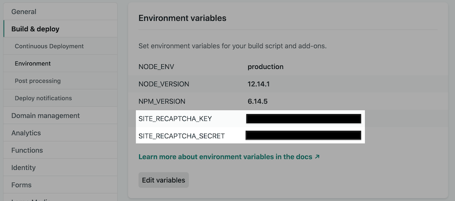

NetlifyにはFormsという便利な機能があり、サーバサイドの実装なしで投稿機能を作ることができる。Freeプランであれば**100件/月の投稿**および**10MB/月のファイルアップロード**が無料で利用できる。個人のブログサイト程度であれば十分すぎる。さらに、reCAPTCHAもサーバサイドの実装なしで追加することができる。

今回はこの機能を使って、GatsbyブログにreCAPTCHA機能付き問合せフォームを追加する。

完成イメージはこんな感じ。


## 1. reCAPTCHAキーの準備
### 1.1. GoogleのreCAPTCHAに登録する
[こちらのサイト](https://www.google.com/recaptcha/intro/v3.html)から無料で登録できる。下記の要領で登録する。

- 今回はreCAPTCHA v2を使用するので、**reCAPTCHA v2** > **「私はロボットではありません」チェックボックス**を選択。
- ドメインには**自身のサイト**のドメインを登録。**localhost**も登録しておくとローカルでのテストができるのでオススメ。


### 1.2. Netlifyの環境変数を登録
先ほど取得したサイトキーおよびシークレットキーをNetlify上に登録する。Settings > Build & Deploy > Environment > Environment variablesに`SITE_RECAPTCHA_KEY`と`SITE_RECAPTCHA_SECRET`キーを登録する。



<adsense></adsense>

## 2. 問合せフォームの作成


### 2.1 問合せフォームの雛形をつくる
まずは問合せページ(`/contact`)の雛形と送信後の遷移先であるThanksページ(`/thanks`)を作る。


```jsx
// ~/src/pages/contact.js
import React from 'react';
import { navigate } from 'gatsby';


export default function Contact() {
  const [state, setState] = React.useState({})

  const handleChange = (e) => {
    setState({ ...state, [e.target.name]: e.target.value })
  }

  const handleSubmit = (e) => {
    // 仮で'/thanks'に遷移するロジックを作っておく
    e.preventDefault();
    const form = e.target;
    navigate(form.getAttribute('action'));
  }

  return (
    <div>
      <h1>問合せフォーム</h1>
      <form
        name="contact"
        method="post"
        action="/thanks/"
        data-netlify="true"
        data-netlify-recaptcha="true"
        onSubmit={handleSubmit}
      >
        <noscript>
          <p>This form won’t work with Javascript disabled</p>
        </noscript>
        <div>
          <input type="text" required name="name" placeholder="お名前" onChange={handleChange} />
        </div>
        <div>
          <input type="email" name="email" placeholder="Email" onChange={handleChange} />
        </div>
        <div>
          <textarea name="message" required placeholder="お問合せ内容" onChange={handleChange} />
        </div>
        {/* ここに後でreCaptchaを入れる */}
        <div>
          <button type="submit">送信</button>
        </div>
      </form>
    </div>
  )
}
```


```jsx
//~/src/pages/thanks.js
import React from "react"

const ThanksPage = (props) => (
  <div>
      <h1>Thanks!</h1>
      <p>お問い合せを受け付けました. ありがとうございます.</p>
  </div>
)

export default ThanksPage;
```

### 2.2 react-google-recaptchaをインストール
```shell
npm install --save react-google-recaptcha
```

### 2.3 問合せフォームにreCAPTCHAを追加する
先ほど作った雛形を少し修正して、reCAPTCHAを追加する。


```jsx
//~/src/pages/thanks.js
import React from 'react';
import { navigate } from 'gatsby';
import Recaptcha from 'react-google-recaptcha'; // 追加

// 追加
const RECAPTCHA_KEY = '[サイトキーに置き換える]'

// 追加
function encode(data) {
  return Object.keys(data)
    .map((key) => encodeURIComponent(key) + '=' + encodeURIComponent(data[key]))
    .join('&')
}


export default function Contact() {
  const [state, setState] = React.useState({})
  const recaptchaRef = React.createRef() // 追加

  const handleChange = (e) => {
    // 変更なし
  }

  const handleSubmit = (e) => {
    e.preventDefault()
    const form = e.target
    // 追加
    const recaptchaValue = recaptchaRef.current.getValue()
    fetch('/', {
      method: 'POST',
      headers: { 'Content-Type': 'application/x-www-form-urlencoded' },
      body: encode({
        'form-name': form.getAttribute('name'),
        'g-recaptcha-response': recaptchaValue,
        ...state,
      }),
    })
      .then(() => navigate(form.getAttribute('action')))
      .catch((error) => alert(error))
    // 追加ここまで
  }

  return (
    <div>
      {/* ...省略... */}
        <div>
          <textarea name="message" required placeholder="お問合せ内容" onChange={handleChange} />
        </div>
        <Recaptcha ref={recaptchaRef} sitekey={RECAPTCHA_KEY} /> {/* 追加 */}
        <div>
          <button type="submit">送信</button>
        </div>
      </form>
    </div>
  )
}
```

上手くいっていれば以下のようなreCAPTCHAが追加されているはず。


<adsense></adsense>

## 3. 稼働確認
Netlifyにデプロイして稼働確認をしてみる.
デプロイが上手くいっていればFormsの画面から以下の表示が見られるはず。


以上。

## 参考
[gatsby-netlify-form-example-v2](https://github.com/sw-yx/gatsby-netlify-form-example-v2)  
[netlify blog - How to Integrate Netlify’s Form Handling in a React App](https://www.netlify.com/blog/2017/07/20/how-to-integrate-netlifys-form-handling-in-a-react-app/)  
[netlify docs - Spam filters#Extra spam prevention](https://docs.netlify.com/forms/spam-filters/#extra-spam-prevention)  