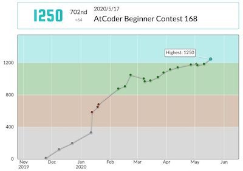
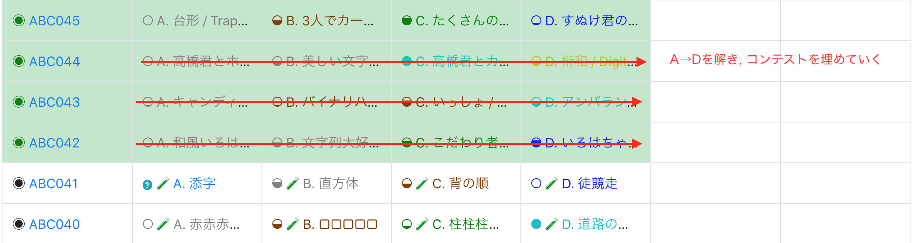

競技プログラミングを始めて苦節半年, やっと水色になった. 使用言語はPython. 始めた当時はプログラミング初心者〜初級者といったレベルで, Pythonの基本文法を少し知っている程度だった.

トレーニングとしてやったことは2つだけ.
 - 蟻本
 - 過去コンテスト埋め

まあ誰もがやっていることでしょう.  
ただ, TwitterやQlita界隈の茶〜緑コーダーの方々を見ていると「何のためにそのトレーニングをするのか」を自分なりに考え・理解してやっている人は少ないように感じる.

「どんな練習でもやらないよりはやった方がまし」は真だが, どうせやるなら効率よくやりたいもの.

というわけで、上記の練習により何が向上し水色レートという成果に繋がったのか、自分なりの解釈を紹介する.

## 水色コーダーに求められる能力は3つ

唐突だが, 水色コーダーには以下3つの能力が必要だと思っている.
1. **基本アルゴリズム・データ構造の理解**  
BFS/DFS, 二分探索, Union-Find木, etc... とにかく知っていないと問題は解けない.
2. **競プロ特有の問題解決の思考法**  
問題の取っ掛かりを得るための思考方法がいくつもあり, 知っているのと知らないのとでは大きな差が生まれる.  
Ex)「ソートして先頭から/末尾から考える」「$2^{15}$程度であれば全探索」「"i番目を使わない"$\Leftrightarrow$"$1$~$i-1$番目と$i+1$~$N$番目を使う"」
3. **コーディング力**  
上記1,2があれば解法は思いつくだろう。しかし、それを速く・正確に実装することが求められる.

で, これらを鍛えるための**蟻本**および**過去コンテスト埋め**なのである。

## 蟻本でアルゴリズム・データ構造の能力を鍛える

言わずもがな、蟻本により能力1の向上が期待できる. 知識として知っていないものは使うことはできない. まずは蟻本に目を通し, 基本アルゴリズム・データ構造のInputから始めることが肝要だ.  
そして, [AtCoder 版！蟻本 (初級編)](https://qiita.com/drken/items/e77685614f3c6bf86f44)などを活用してOutputも行い, 能力1を身につけていく.

## 過去コンテスト埋めで競プロ特有の思考法&コーディング力を鍛える

ここでよく見かける間違い(と僕が思っている練習法)は, A埋め→B埋め→C埋め→D埋めと簡単な問題から埋めていく方法だ. なぜなら, A-B-C問題というのは上記能力1,2,3への寄与が相対的に少ない. 無駄とは言わないが効率が悪いのだ.

各レベルの問題を解く際に必要な能力 
(ほぼ不要:🌑 少し要:🌘  要:🌗 とても要:🌕)

| # | 能力 | A | B | C | D~E |
|:-:|----|:-:|:-:|:-:|:-:|
|1|基本アルゴリズム・データ構造の理解 | 🌑 | 🌑 | 🌗 | 🌕 |
|2|問題解決の思考法| 🌑 | 🌑 | 🌗 | 🌕 |
|3|コーディング力| 🌘 | 🌘 | 🌗 | 🌕 |

上記は僕が考える必要能力と問題難易度の関係だ. AB問題は能力1,2,3いずれもほとんど不要である. 逆に言うと, AB問題をいくら解いたところで能力向上への寄与は僅かなのだ. C問題は幾分かマシだが, やはりD~E問題を解いた方が効果は高い.

ではどうすれば良いのかと言うと, 僕がオススメするのは**コンテスト埋め**である. ABC過去コンテストを1回ずつA問題からD(E)問題までやり切り, 過去コンテストを埋めていく.

 A-B問題はもちろん無駄ではない. ただ, 限られた時間内で効率よく鍛錬するために, D(E)問題も同じペースでACを積み重ねていくのだ.  
この方法により, 能力1,2,3が水色水準に到達するはずだ.

## 結論
もうね, ごちゃごちゃ考えんと, とにかく過去問解きまくったったらええんですよ！

