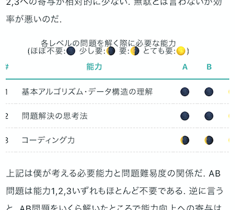

MarkdownでTableを書こうとして苦労したことをメモ.

このブログは`gatsby-remark`で実装してるけど, 標準のスタイルだとスマホ表示になったときにテーブルのレイアウトが崩れてしまう. また, テーブルのタイトル(captionタグ)がつけられないのもなんとかしたい.

というわけで, `gatsby-remark`のTableをレスポンシブ対応＆タイトル付きにする方法を解説する.



## アプローチ
調べてみると綺麗な解決法は無いようで, なんとか無理矢理マークアップするしかないようだ. 下記2つの方法がある.

1. `gatsby-remark-custom-blocks`を使う
2. htmlタグを直書きする.

今回は2の方法で進める.

## 実装
まず, htmlから.  
Markdown標準のテーブルをdivで囲む.

```markdown
<!-- html -->
<!-- 全体をdivで囲み, 任意のclass名をつける. -->
<div class='scrollable-table'> 
<p>
<!-- テーブルのタイトルをp要素として書く -->
タイトル
</p>

<!-- いつも通りテーブルを書く. 1行空けること -->
|a  |b  |c  | 
|---|---|---|
|1  |2  |3  |
|4  |5  |6  |

</div>
```

そして, css.
```css
/* css */
  .scrollable-table {
    p {
      text-align: center; /* タイトルを中央寄せ. */
    }
  }
  @media screen and (max-width: 780px) {
    .scrollable-table {
      overflow-x: auto; /* スマホ画面ではスクロール表示されるように. */
    }
    .scrollable-table table {
      min-width: 480px; /* スマホ画面ではスクロール表示されるように. */
    }
  }
```

以上.

