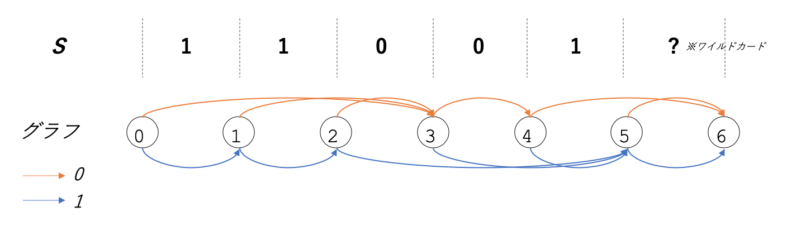
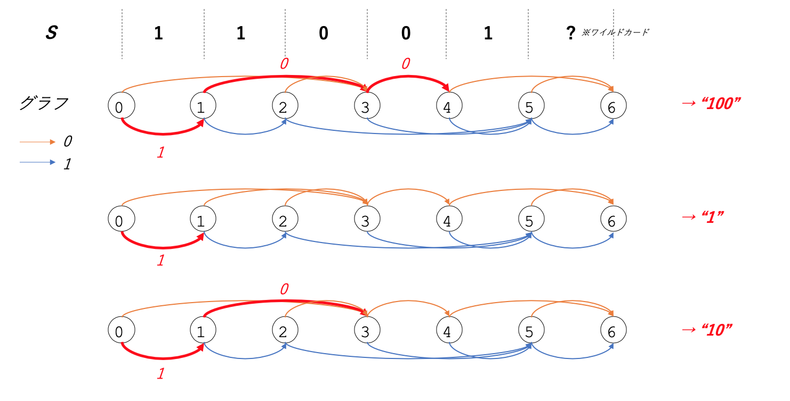
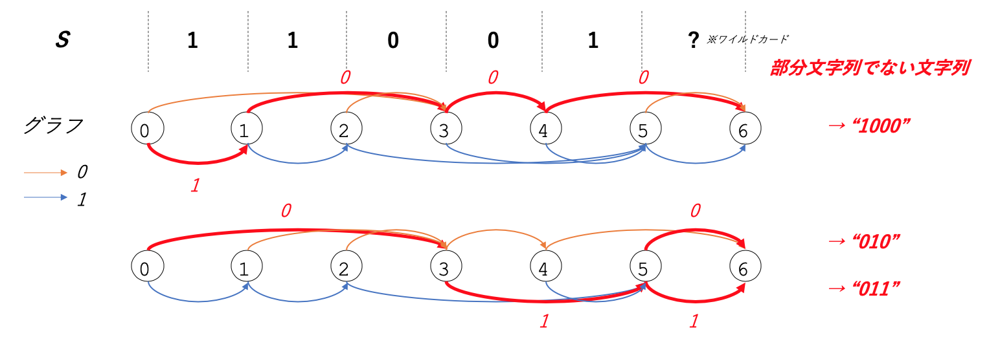

[AtCoder 版！蟻本 (初級編)の「部分文字列DP」](https://qiita.com/drken/items/e77685614f3c6bf86f44#%E4%BE%8B%E9%A1%8C-2-3-15%E9%83%A8%E5%88%86%E6%96%87%E5%AD%97%E5%88%97-dp)をやっていて思ったこと。


部分文字列DP系の問題には2種類ある。

1. 部分文字列を問う問題 - ex) [AOJ 2895 回文部分列](http://judge.u-aizu.ac.jp/onlinejudge/description.jsp?id=2895)
2. 部分文字列**でない**文字列を問う問題 - ex) [ARC081-E: Don't Be a Subsequence](https://atcoder.jp/contests/arc081/tasks/arc081_c)

1.に関してはこちらの解説が素晴らしい。完全に理解できる。
[部分列 DP --- 文字列の部分文字列を重複なく走査する DP の特集](https://qiita.com/drken/items/a207e5ae3ea2cf17f4bd)

しかし、2.が難しい。考え方がどこにも解説されていない。DPの遷移式や数式は書いてあるが、「なぜその式・ロジックでいけるのか」が直感的に理解できなかった。

理解不十分なまま問題を解き進めていたら、[AOJ 1392](https://onlinejudge.u-aizu.ac.jp/problems/1392)の[公式解説](https://icpc.iisf.or.jp/2018-yokohama/wp-content/uploads/sites/5/2019/03/report.pdf)がとてもわかりやすく理解につながった。

というわけで、以下**部分文字列でない文字列を問う問題**を解く上で基本となる考え方を解説する。

## 末尾にワイルドカードを追加し、"文字列走査グラフ"を構成する

文字列走査グラフとは私が勝手につけた名前である。問題を解くにあたり、まずは入力の文字列$S$から以下方法でグラフを構成する。なお$N=|S|$とする。
- **ワイルドカード**: 文字列の末尾にワイルドカード($0$とも$1$ともマッチする特殊文字)を追加する
- **頂点**: 文字と文字の間を頂点とする($0$〜$N+1$の計$N+2$個の頂点が存在)
- **辺**: 各頂点から、それより後で最初に現れる文字$0$の直後の頂点に遷移する有向辺を張る。文字$1$についても同様。

例えば$S='11001'$のときは以下のようになる。



Pythonでの実装の仕方は以下。
```python
S = '11001'
N = len(S)

edge = [[N + 1] * 2 for _ in range(N + 1)]
# 隣接リストを N+1 で初期化
# なお、頂点N+1は辺を持たないため隣接リストには含めていない
# edge[0] = [6, 6, 6, 6, 6, 6]
# edge[1] = [6, 6, 6, 6, 6, 6]

for i in range(N - 1, -1, -1):
    for j in range(2):
        edge[i][j] = edge[i + 1][j]
    edge[i][S[i]] = i + 1
# 後ろから見ていく
# edge[0] = [3, 3, 3, 4, 6, 6]
# edge[1] = [1, 2, 5, 5, 5, 6]
```

さて、この文字列遷移グラフは下記2つの重要な性質を持つ。

## 性質1: 頂点0から各頂点への経路が、$S$のすべての部分文字列を表す

頂点0を出発してどこかの頂点に到る、その経路が部分文字列を表している。ただし頂点6は除く必要がある。

例えば、下図の赤線の経路$1→0→0$は、"$100$"という部分文字列を表す。
また、途中の$1$や$1→0$も部分文字列を表す。経路の始点は必ず頂点0であることに注意。
これらすべての経路を列挙すると$S$の"すべての"部分文字列がわかる。



## 性質2: 頂点$0$から頂点$6$への経路が、$S$の部分文字列でないすべての文字列を表す

ワイルドカードを入れた理由がここにある。頂点$0$から頂点$6$への経路が、$S$の部分文字列でないすべての文字列を表すのである。  



「ある頂点$a$から頂点$6$に辺$x$が存在する」$\Leftrightarrow$「頂点$a$以降に文字$x$は存在しない」


従って、頂点$0→\cdots→a→6$の経路が表す文字列は$S$の部分文字列たり得ない。なぜなら、もし部分文字列になるのであれば、頂点$a$から出ている辺$x$は頂点$6$以外を指す必要があるためである。  
なお、正確を記すなら性質2は「$S$の部分文字列でない文字列のうち、"長さが$N+1$以下"のものすべてを表す」となる。  

## Recap  
性質1: **頂点$0$から頂点$6$以外への経路が、$S$のすべての部分文字列を表す**  
性質2: **頂点$0$から頂点$6$への経路が、$S$の部分文字列でないすべての文字列を表す**  

## 例題: ARC081-E: Don't Be a Subsequence
以上の知識を使って、例題として[ARC081-E](https://atcoder.jp/contests/arc081/tasks/arc081_c)を解いてみる。

### 問題
Aの部分列でないような最短の文字列のうち，辞書順最小のものを出力せよ．  
制約  
  $1\leq|A|\leq2\times10^5$  
  $A$は英小文字のみからなる.

### 考え方
文字種が26あるため、各頂点から26本の辺が出るグラフを構成する。


そして、性質$2$を使うことでこの問題は以下のように言い換えられる。


***頂点$0$から頂点$N+1$への最短経路のうち、辞書順最小のものを出力せよ。***


最短経路を求めるには$BFS$を使えばよく、辞書順最小については各頂点にて辺を探すときに$a$の辺からアルファベット昇順に探すことで自然と満たされる。 

えぇ...DPじゃないじゃん！ DP使ってもいいんですけどね。。

### 解答 - Python3
※残念ながらPypyじゃないと通らない。。。

```python
from collections import deque


A = input()
N = len(A)
a = ord('a')

# edge[頂点][辺x]
edge = [[N + 1] * 26 for _ in range(N + 1)]

for i in range(N - 1, -1, -1):
    for j in range(26):
        edge[i][j] = edge[i + 1][j]
    # 文字cの直後の頂点への辺を貼る
    c = ord(A[i]) - a
    edge[i][c] = i + 1

# DP復元用。(直前の頂点, 文字)を格納する。
recon = [None] * (N + 2) 

q = deque()
q.append(0)  # 頂点0
while q:
    i = q.popleft()

    # 頂点N+1に到達したら処理終了
    if i == N + 1:  
        break
    
    # aの辺から順に処理する
    for j in range(26):
        ni = edge[i][j]
        # 頂点niに最短で到達した場合のみ次の処理を実施
        # "辞書順最小"という条件により最短でない場合は枝切りしてよい
        if recon[ni] is None:  
            recon[ni] = (i, chr(a + j))
            q.append(ni)


# reconから文字列を復元
i = N + 1
ans = []
while i > 0:
    pi, c = recon[i]
    ans.append(c)
    i = pi

print(''.join(reversed(ans)))
```

## 文字列走査グラフを制するものは部分文字列を制す

部分文字列系の問題は、この文字列走査グラフをベースに考察するのが一番簡単な気がする。境界条件の取り扱いもシンプルになる。

いずれの解法にせよ、Pythonだと文字種26の定数倍がけっこう効いてきて実行時間制約がつらい。  
Numpyとか使えよって話ですかね。