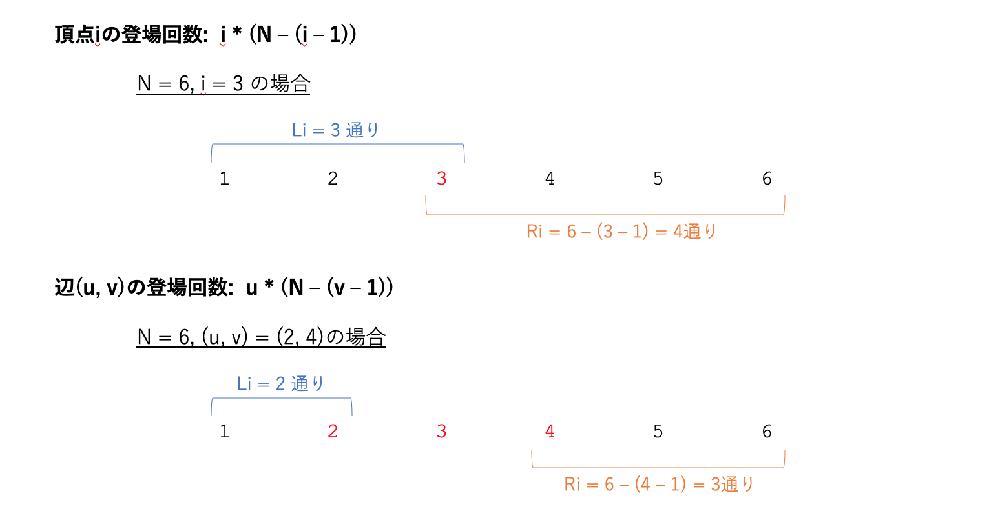

ABC173に参加しました. 
結果は4完1372ndでパフォーマンス1404... 力不足です..

今回はpypyを使わなくても大丈夫な問題ばかり.

## A - Payment
```python
N = int(input())

for i in range(1, 11):  # 最大で1万円 = 1千円 * 10
    if 1000 * i >= N:
        break
print(1000 * i - N)

```

## B - Judge Status Summary
collections.Counterで一瞬で算出できる.

答えの書式が独特. コンテスト中は愚直に書き下した.

```python
from collections import Counter


N = int(input())
S = [input() for _ in range(N)]
C = Counter(S)
print('AC x ' + str(C['AC']))
print('WA x ' + str(C['WA']))
print('TLE x ' + str(C['TLE']))
print('RE x ' + str(C['RE']))
```

もう少し綺麗に解くならこんな感じか.
```python
from collections import Counter


N = int(input())
S = [input() for _ in range(N)]
C = Counter(S)
for result in ['AC', 'WA', 'TLE', 'RE']:
    print(result + ' x ' + str(C[result]))
```

## C - H and V
制約 $1 \leq H, W \leq 6$ が異常に小さい. 全探索系の問題だと気づくはず.  

行の選び方$2^H \leq 2^6$, 列の選び方$2^W \leq 2^6$ で計$2^{12}$.  
それぞれの場合について$H * W\leq 6^2$マスを数え上げる.  
したがって, 計算量は$147456$ ~= $10^5$となり十分に間に合う.

行・列の塗る/塗らないを表すビット列の生成に**itertools.product**を使った.  
実装がシンプルになるのでオススメ. 計算時間に余裕があるときは積極的に使っていきたい.  


```python
from itertools import product

H, W, K = map(int, input().split())
grid = [input() for _ in range(H)]

ans = 0
for row in product([0, 1], repeat=H):
    for col in product([0, 1], repeat=W):
        cnt = 0
        for i in range(H):
            for j in range(W):
                # 当該のマス(i, j)が赤く塗られておらず かつ 黒色のとき
                if row[i] and col[j] and grid[i][j] == '#':
                    cnt += 1
        if cnt == K:
            ans += 1

print(ans)
```

## D - Chat in a Circle
厳密な証明は公式解答を参照して欲しいが, 考え方は以下の通り. 


- **$A_i$の大きい人から順に到着させる**. これは, 既に到着している人の中から**心地よさ**が算出されるため, できるだけ$A_i$の大きい人が輪にいた方が有利なためである.  
- **心地よさは常に輪の中央値となる**.  例えば, 輪が[5, 4, 3, 2, 1]でできている場合, 次に入る人の**心地よさ**は中央値の$3$となる.  輪が偶数人のときは小さい方, すなわち[10, 8, 4, 3]の場合は$4$となる.  

```python
N = int(input())
A = list(map(int, input().split()))
A.sort(reverse=True)  # 大きい順にソート
B = []  # 既に到着した人. 大きい順に追加される.
cnt = 0
for a in A:
    if len(B) != 0:
        j = len(B) // 2  # 中央値の位置を求める
        cnt += B[j]
    B.append(a)
print(cnt)
```

## E - Multiplication 4
解説AC.  
公式解説の解法2を用いた. 場合分けが非常に複雑で実装が難しい問題.  

まず大方針として下記の３パターンに分ける.  
- パターン1: $K == N$ のとき
- パターン2: $A_i$がすべて負の数 かつ $K$が奇数のとき  
- パターン3: 上記以外

さらにパターン3の中で細かく場合分けが必要となる.  

```python
N, K = map(int, input().split())
A = list(map(int, input().split()))
MOD = 10 ** 9 + 7

# パターン1: K == N のとき
if K == N:
    ans = 1
    for a in A:
        ans *= a
        ans %= MOD
    print(ans)
    exit()

# 非負整数Pと負整数Mに分ける
P = []
M = []
for a in A:
    if a >= 0:
        P.append(a)
    elif a < 0:
        M.append(a)

# パターン2: すべて負の数 かつ Kが奇数のとき
if len(P) == 0 and K % 2 == 1:
    ans = 1
    M.sort(reverse=True)
    for k in range(K):
        ans *= M[k]
        ans %= MOD
    print(ans)
    exit()

# パターン3: それ以外
P.sort(reverse=True)
M.sort()
LP = len(P)  # LP: リストPの長さ
LM = len(M)  # LM: リストMの長さ
cur_p = 0    # cur_p: リストP内での位置
cur_m = 0    # cur_m: リストM内での位置
cnt = 0      # cnt: 選んだ要素の数
ans = 1      # ans: 答え mod(10**9 + 7)
while cnt < K:  # 要素をK個選ぶまで続ける
    if K - cnt == 1 or LM - cur_m <= 1:  # 既にK-1個選んだ or Mが残り1個以下 のとき必ずPから選ぶ
        flag = 'p'
    elif LP - cur_p == 1:  # Pが残り1個のとき
        if (K - cnt) % 2 == 1:  # 残り奇数個選ぶとき、Pの最後の要素は必ず選ばれる.
            flag = 'p'
        else:                   # 残り偶数個選ぶとき、Pの最後の要素は選んではいけない.
            flag = 'm'
    elif LP - cur_p == 0:  # Pが残り0個のとき
        flag = 'm'
    else:  # Pが残り2個以上 かつ Mが残り2個以上 のとき
        p1 = P[cur_p]
        p2 = P[cur_p + 1]
        m1 = M[cur_m]
        m2 = M[cur_m + 1]
        if p1 * p2 >= m1 * m2:
            flag = 'p'
        else:
            flag = 'm'
    
    if flag == 'p':  # Pから選ぶときは1個選ぶ
        ans *= P[cur_p]
        ans %= MOD
        cur_p += 1
        cnt += 1
    else:  # Mから選ぶときは2個同時に選ぶ
        ans *= M[cur_m] * M[cur_m + 1]
        ans %= MOD
        cur_m += 2
        cnt += 2

print(ans)
```

## F - Intervals on Tree
解説AC.

連結成分の数を数え上げる問題だが, ポイントは***森***に対して下記の式が成り立つことである.
- **頂点数** - **辺数** = **連結成分数**  

足し算(頂点数、辺数の数え上げ)と引き算のみで算出できるのが肝となっており, つまり, 

- ある$(L_1, R_1)$について, **頂点数$V_1$** と **辺数$E_1$** を足し引きすれば **連結成分数$F_1$** が算出できる. 
- 別の$(L_2, R_2)$についても, **頂点数$V_2$** と **辺数$E_2$** を足し引きすれば **連結成分数$F_2$** が算出できる.  
- ここで、$(L_1, R_1)$の場合も$(L_2, R_2)$の場合も足し引きするだけなので, **頂点数$V_1+V_2$** だけを先に求めて, その後に**辺数$E_1 + E_2$**を求めて足し引きしても同じ**結果**$F_1+F_2$が得られることがわかる. 
- この考え方をさらに押し進めると, $V_x$の合計を求めるにはそれぞれの頂点$v_i$がどの$(L_x, R_x)$に登場するかカウントすればよく, $E_x$の合計を求めるには辺$e_i$がどの$(L_x, R_x)$に登場するかカウントすればよいことがわかる.  

頂点および辺の登場回数のカウント方法は下記.  


なお、辺$(u, v)$は必ず$u\lt v$となっている必要がある.
実装は非常に簡単.

```python
import sys


N = int(input())
num_V = 0  # 頂点の登場回数の合計
for i in range(1, N + 1):
    tmp = i * (N - (i - 1))
    num_V += tmp

num_E = 0  # 辺の登場回数の合計
for s in sys.stdin.readlines():
    u, v = map(int, s.split())
    if u > v:
        u, v = v, u
    tmp = u * (N - (v - 1))
    num_E += tmp

print(num_V - num_E)  # 連結成分の数 = 頂点の数 - 辺の数
```