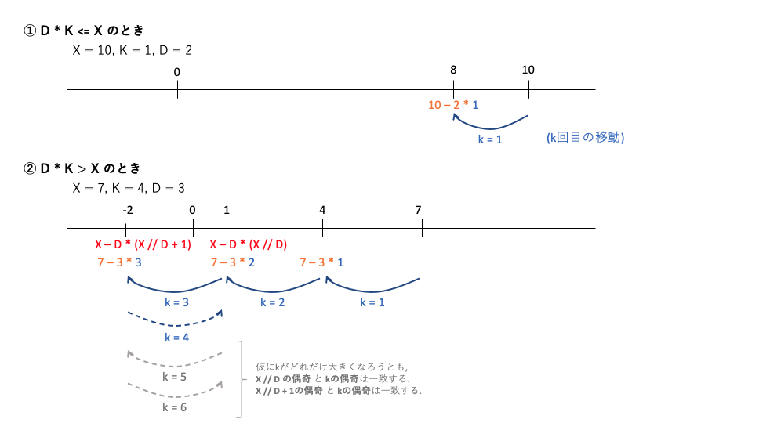

ABC175に参加しました. 
結果は4完1065thでパフォーマンス1468... 実力相応かなと..

今回は全体的に考察:易, 実装:難だったように感じます.

## A - Rainy Season
'R'が存在するか, 'RR'が存在するか, ... と順に調べる.
```python
S = input()
for i in range(4):
    if 'R' * i in S:
        ans = i
print(ans)
```

## B - Making Triangle
考え方は公式解説の通り.  
候補となる3本の棒を選ぶ処理は, pythonであれば`itertools.combinations`を使うと簡単に実装できる.

```python
from itertools import combinations

N = int(input())
L = list(map(int, input().split()))
cnt = 0
if N >= 3:
    for edges in combinations(L, 3):
        a, b, c = edges
        if len(set(edges)) == 3 and a < b + c and b < c + a and c < a + b:
            cnt += 1
print(cnt)
```

## C - Walking Takahashi
これは考察が難しめの問題.  

考え方は以下の通り.
- 対称性により, $X$は正の数($X := abs(X)$) として考える.
- ①$K * D \le X$ のときは, $K$回とも$-D$動く場合が最も原点に近い. $X - D * K$が答えとなる.
- ②$K * D \gt X$ のときを考える. 解答の候補となる点は, 原点に近い**0以上の点**, **負の点**のどちらかである. この2点を行ったり来たりする移動をすることがわかる.
- $r := X // D$とすると, **0以上の点**は$X - D * r$ であり, **負の点**は $X - D * (r + 1)$ と求めることができる. 
- では, 最終的にどちらの点に止まるのか?
- ここでパリティの関係より, r % 2 == K % 2 のときは**0以上の点**, r % 2 != K % 2のときは**負の点**に止まる.



```python
X, K, D = map(int, input().split())
X = abs(X)

if K * D <= X:
    ans = X - K * D
else:
    r = X // D
    l = X // D + 1
    if r % 2 == K % 2:
        ans = abs(X - D * r)  # 0以上の点
    else:
        ans = abs(X - D * l)  # 負の点
print(ans)
```

## D - Moving Piece
考察はわりと易しいと思うが, 実装が複雑.
場合分けが難しい.

- $P_i\neq i$ および $P_1, P_2,\dots,P_N$は全て異なるという条件より, どこからスタートしてもスタート地点に必ず帰ってくるループとなる.  
- $N \leq 5000$より, すべてのスタート地点についてループ経路を求めても最悪$O(N^2)$となり, なんとか間に合いそう.

よって, 以下スタート地点$s$として考える. 各$s$について以下のStepを回す.
- Step1: s -> 1番目の点 -> 2番目の点 -> s(最後の点) となるループについて, 得点の累積和Sを求める. 
- Step2: $K$と$len(S)$の大小で場合分けして, 得点の最大値を求める. ケースA: $K \leq len(S)$のとき, ケースB: $K \gt len(S)$のとき.
- ケースAのときはループを1週しないため, 到達可能な点でのSの最大値が答えとなる.
- ケースBのときはさらに場合分けが必要. S[-1]$\leq 0$のときは1週以上するメリットがないため同様にSの最大値が答えとなる. S[-1]$>0$のときは回れるだけ回りたいところだが, 実は**1周少なく回った方が得点が高くなることがある**ため, 両方の場合での得点を算出して比較する.

```python
N, K = map(int, input().split())
P = list(map(int, input().split()))
C = list(map(int, input().split()))

ans = -float('inf')
for s in range(N):
    ### Step1
    S = []  # 累積和S. ただし, 初項は0ではなく1回目の移動後の得点とする.
    # 1回目の移動
    i = P[s] - 1
    S.append(C[i])
    # 2回目以降の移動. スタート地点に戻ってくるまで繰り返し.
    while i != s:
        i = P[i] - 1
        S.append(S[-1] + C[i])

    ### Step2: KとSの長に応じて場合分けして, 得点の最大値を求める.
    # 1周未満しか移動できない場合:
    if K <= len(S):
        score = max(S[:K])
    # 1周以上回ることができるが, ループを1周したときに得点が減る場合:
    elif S[-1] <= 0:
        score = max(S)
    # 1週以上回ることができ, かつループを1週するごとに得点が増える場合:
    else:
        # ループを (K // len(S) - 1)回 廻る場合:
        score1 = S[-1] * (K // len(S) - 1)
        score1 += max(S)
        # ループを (K // len(S))回 廻る場合:
        score2 = S[-1] * (K // len(S))
        r = K % len(S)
        if r != 0:
            score2 += max(0, max(S[:r]))
        # score1 と score2 の大きい方がこの場合の得点の最大値
        score = max(score1, score2)

    ans = max(ans, score)

print(ans)
```

## E - Picking Goods
コンテスト終了後20分ほどでACできた.. うーん実装力不足.  
わりと典型的なDPの問題.

```python
import sys

R, C, K = map(int, input().split())
item = [[0] * (C + 1) for _ in range(R + 1)]  # dp配列と合わせるために, 0行目, 0列目を追加している.
for s in sys.stdin.readlines():
    r, c, v = map(int, s.split())
    item[r][c] = v

dp = [[[0] * (C + 1) for _ in range(R + 1)] for _ in range(4)]
for i in range(R + 1):
    for j in range(C + 1):
        for k in range(4):
            here = dp[k][i][j]
            # 次の行に移動する場合
            if i + 1 <= R:
                # 移動先のアイテムを取らない場合
                dp[0][i + 1][j] = max(dp[0][i + 1][j], here)
                # 移動先のアイテムを取る場合
                dp[1][i + 1][j] = max(dp[1][i + 1][j], here + item[i + 1][j])
            # 次の列に移動する場合
            if j + 1 <= C:
                # 移動先のアイテムを取らない場合
                dp[k][i][j + 1] = max(dp[k][i][j + 1], here)
                # 現在のkが3未満のときのみ, 移動先のアイテムを取ることが可能
                if k < 3:
                    dp[k + 1][i][j + 1] = max(dp[k + 1][i][j + 1], here + item[i][j + 1])
ans = 0
for k in range(4):
    ans = max(ans, dp[k][-1][-1])
print(ans)
```

## F - Making Palindrome
TBA
