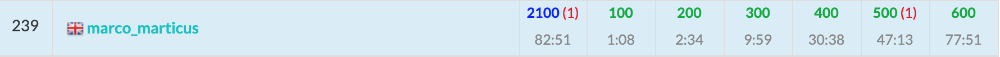

ABC188に参加しました。結果は$6$完$239$位パフォーマンス$2092$!!  
初の全完＆黄パフォで, ここ最近の損失を取り返す大フィーバーでした！ うれしい！


  

以下, A~F問題の解説およびPython解答例です.

## A - Three-Point Shot
$X, Y$の差の絶対値により判定する.


```python
X, Y = map(int, input().split())
ans = 'Yes' if abs(X - Y) < 3 else 'No'
print(ans)
```

## B - Orthogonality
`Numpy`使えば一瞬なのかな。

愚直に`zip`を使って$A_iB_i$の総和を計算する。


```python
N = int(input())
A = list(map(int, input().split()))
B = list(map(int, input().split()))
ans = 'Yes' if sum(a * b for a, b in zip(A, B)) == 0 else 'No'
print(ans)
```

<adsense></adsense>

## C - ABC Tournament
決勝以外は問題文の定義通りにトーナメントをシミュレーションする。

```python
N = int(input())
A = list(map(int, input().split()))
A = [(a, i) for i, a in enumerate(A)]  # Ai のインデックスを取得する

while len(A) > 2:  # 決勝の前まで(--> 残った人数が2人より多いとき)
    L = len(A)
    nA = []
    for k in range(L // 2):
        l, r = A[2 * k], A[2 * k + 1]
        win = max(l, r)
        nA.append(win)
    A = nA

second = min(A)
print(second[1] + 1)
```

なお、公式解法2として以下の考え方がある。こちらの方が実装がだいぶ楽。  
決勝に残る2人は、**左半分ブロックの最大の人** と **右半分ブロックの最大の人** なので、この2人のうち小さい方が準優勝者である。

```python
N = int(input())
A = list(map(int, input().split()))

half = pow(2, N - 1)
second = min(max(A[:half]), max(A[half:]))
print(A.index(second) + 1)
```


## D - Snuke Prime
`座標圧縮`と`imos法`の合わせ技。  
今回のセットの中では一番実装が大変だった。


```python
import sys
from itertools import accumulate


N, C = map(int, input().split())
service = [None] * N
for i in range(N):
    a, b, c = map(int, sys.stdin.readline().split())
    a -= 1; b -= 1
    service[i] = (a, b + 1, c)  # imos法を見据えて, b は b + 1 とする

# 座標圧縮
day = set()
for a, b, c in service:
    day.add(a)
    day.add(b)
day = sorted(day)  # day[i]: 実日付を昇順に並べたリスト
D = {}  # D[d]: 実日付-->dayのインデックスに対応づけるためのマップ
for i, d in enumerate(day):
    D[d] = i
L = len(day)  # L: dayの長さ

# imos法
service.sort()
S = [0] * L
for a, b, c in service:
    S[D[a]] += c
    S[D[b]] -= c
T = list(accumulate(S)) # T[i]: 期間i(day[i + 1] - day[i])における1日あたりの従量料金

# 各期間iについて, 従量料金と定額料金を比較しどちらを採用するか決める。
# 期間の長さ(=日数)は day[i + 1] - day[i] により計算できる。
ans = 0
for i in range(L - 1):
    cost = min(T[i], C)
    days = day[i + 1] - day[i]
    ans += cost * days
print(ans)
```

<adsense></adsense>

## E - Peddler 
$X_i < Y_i$ という制約のおかげで方針がかなりわかりやすくなったと思う。


考え方は以下の通り。
- $dp[i] = i \text{番目の街から出発したときの売却価格の最大値}$ とおく。i番目の街では売れないことに注意。
- すると、街$i$で金を買った場合の利益の最大値は$dp[i] - A[i]$で算出できる。
- $dp$の遷移は、  
$dp[i] \leftarrow max(dp[i], dp[j], A[j])$ ただし, $\{j$ $|$  $i\text{から到達可能な街}\}$  
とすればよい。


```python
import sys


N, M = map(int, input().split())
A = list(map(int, input().split()))
edge = [[] for _ in range(N)]
for _ in range(M):
    X, Y = map(int, sys.stdin.readline().split())
    X -= 1; Y -= 1
    edge[X].append(Y)

INF = float('inf')
dp = [-INF] * N
ans = -INF
for v in range(N - 1, -1, -1):
    for nv in edge[v]:
        dp[v] = max(dp[v], dp[nv], A[nv])
    ans = max(ans, dp[v] - A[v])
print(ans)

```

<adsense></adsense>

## F - +1-1x2
計算量に自信がなかったが、とりあえず提出してみたら通った。ラッキーだったな。

考え方は以下の通り。
- $Y$から$X$に減らす操作を考える。
- $Y \leq X$ の時は、答えは$X - Y$となる。
- $Y > X$のときは, $Y$の偶奇によって変わる。
- $Y$が偶数の時は、下記の$2$通りのどちらか。  
$2$分の$1$をする: $f(Y // 2) + 1$  
$1$ずつ減らす: $Y - X$
- $Y$が奇数の時は、下記の$3$通りのどれか。  
$f(Y + 1)$ + 1  
$f(Y - 1)$ + 1  
- 以上をメモ化再帰で実装する。

```python
def dfs(n):
    global X, memo
    if n not in memo:
        if n <= X:  # n <= X のときは必ず X - n
            ret = X - n
        elif n % 2 == 0:  # n が偶数の時
            c1 = dfs(n // 2) + 1
            c2 = n - X
            ret = min(c1, c2)
        else:  # n　が奇数の時
            c1 = dfs(n + 1) + 1
            c2 = dfs(n - 1) + 1
            ret = min(c1, c2)
        memo[n] = ret
    return memo[n]


X, Y = map(int, input().split())
memo = {}
ans = dfs(Y)
print(ans)
```

## まとめ
Atcoder  
初めて全問  
解けたから  
1月10日は  
全完記念日
