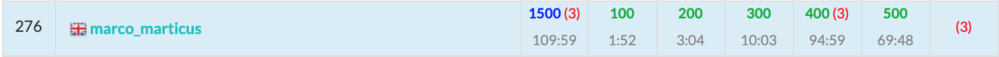

ABC191に参加しました. 結果は$5$完$276$位パフォーマンス$2106$!!.  
自己ベストパフォーマンスでした〜



以下, A~E問題の解説およびPython解答例です.

*2021/02/07: F問題の解説を追加*


<adsense></adsense>


## A - Vanishing Pitch
こういう素直なA問題が好き。

```python
V, T, S, D = map(int, input().split())
ans = 'No' if V * T <= D <= V * S else 'Yes'
print(ans)
```

## B - Remove It
$X$と等しい要素だけを消す。  
`list.remove()`を使うと、配列の再構築に$\mathcal{O}(N)$要するため間に合わない(はず)。

```python
N, X = map(int, input().split())
A = map(int, input().split())
print(*[a for a in A if a != X])
```

<adsense></adsense>

## C - Digital Graffiti
問題文がわかりにくいのに加え、サンプルが1つしかないため題意を読み取りづらい問題。  

- 各交点を一つずつ調べていく。
- 周囲$4$マスのうち**#**が奇数個存在するとき、その点が多角形の頂点となる。
- よってこの問題は、条件を満たす点を数え上げるだけの問題。

```python
H, W = map(int, input().split())
S = [input() for _ in range(H)]
ans = 0
for h in range(1, H):
    for w in range(1, W):
        cnt = 0
        for i in range(2):
            for j in range(2):
                if S[h - i][w - j] == '#':
                    cnt += 1
        if cnt % 2 == 1:
            ans += 1
print(ans)
```

## D - Circle Lattice Points
この問題は誤差の扱いが難しい。。

基本的な考え方は以下。

- 半径$R$, 中心$(X, Y)$の円の内部の点$(x, y)$は以下を満たす。  
$(x - X)^2 + (y - Y)^2 \leq R^2$
- ここでまず$y$の取り得る範囲を考える。$(x - X)^2 = 0$のとき $y$ は最大および最小になる。  
$\begin{aligned} & (y - Y)^2 \leq R^2 \\ \Leftrightarrow & -R \leq y - Y \leq R \\ \Leftrightarrow & Y - R \leq y \leq Y + R\end{aligned}$
- したがって、$y$の取り得る値の個数は高々$\mathcal{O}(R)$である。よって、$y$の値について全探索することを考える。
- $y$の値を決めると、  
$(x - X)^2 \leq R^2 - (y - Y)^2$  
となり、上記を満たす$x$の値の個数を求めればよい。
- $Z^2 = R^2 - (y - Y)^2$とおくと,  
$\begin{aligned} & (x - X)^2 \leq Z^2 \cdots \text{①}\\ \Leftrightarrow & X - Z \leq x \leq X + Z\end{aligned}$  
となるのだが、この$Z$の値を決める際に誤差が問題になり、工夫がいる。


### 解法1 - すべてint型 & 二分探索
本番ではこの方法で通した。  
①式を満たす$x$の最大値・最小値を2分探索により求める。`sqrt`を使わないため誤差を考えなくて良い。

```python
from decimal import Decimal


def binary_search(ok, ng):
    '''
    ok < ng: 最大値を求める
    ok > ng: 最小値を求める
    '''
    global offset, X, Z2
    while abs(ok - ng) > 1:
        mid = (ok + ng) // 2
        if (mid * offset - X) ** 2 <= Z2:
            ok = mid
        else:
            ng = mid
    return ok


offset = 10 ** 4
X, Y, R = map(lambda x: int(Decimal(x) * offset), input().split())
ans = 0
x = X // offset  # 元の座標系でのint(X)に等しい
INF = 10 ** 6
for y in range((Y - R) // offset, (Y + R) // offset + 1):  # yについて全探索
    Z2 = R ** 2 - (y * offset - Y) ** 2
    if Z2 >= 0:
        # 左側: -INF ~ x の中で条件を満たす格子点 の数を求める
        if (X - x * offset) ** 2 <= Z2:
            ok = x
            ng = -INF
            min_x = binary_search(ok, ng)  # min_x: 条件を満たす格子点の最小値
            cnt = x - min_x + 1
            ans += cnt
        # 右側: x + 1 ~ INF の中で条件を満たす格子点 の数を求める
        if (X - (x * offset + offset)) ** 2 <= Z2:
            ok = x + 1
            ng = INF
            max_x = binary_search(ok, ng)  # max_x: 条件を満たす格子点の最大値
            cnt = max_x - (x + 1) + 1
            ans += cnt
print(ans)
```

### 解法2: Decimal型
`Decimal`を使って`sqrt`を求める。  
`sqrt`を計算する前に微小値を足すことが肝となる。  

同じ考え方で`float`でもできるはずだが、私はまだ解けていない。。。

なお, `Pypy`だと通らない。

```python
from decimal import Decimal, Context, ROUND_FLOOR, setcontext
C = Context(rounding=ROUND_FLOOR)
setcontext(C)


X, Y, R = map(Decimal, input().split())
zero = Decimal('0')
ans = 0
e = Decimal('1E-12')  # e: 微小値

for y in range(int(Y - R), int(Y + R) + 1):
    Z2 = R ** 2 - (y - Y) ** 2
    if Z2 >= zero:
        Z = C.sqrt(Z2 + e)  # sqrtを計算する前にeを足す
        l = X - Z
        r = X + Z
        cnt = int(r.quantize(zero)) - int(l.quantize(zero))  # floorを取った後にintに変換する
        ans += cnt
print(ans)
```

<adsense></adsense>

## E - Come Back Quickly
こっちが$D$問題くらいでも良さそう。  
比較的素直な最短経路問題。

- `ダイクストラ法`を各町から計$N$回実行するだけ。
- 自己ループがあるため「スタート地点 → スタート地点」とすぐに到着する場合の扱いに少し工夫が必要

```python
from heapq import heappush, heappop


N, M = map(int, input().split())
edge = [[] for _ in range(2 * N)]

for _ in range(M):
    a, b, c = map(int, input().split())
    a -= 1; b -= 1
    edge[a].append((b, c))

ans = [-1] * N
path = [-1] * (2 * N)
for i in range(N):
    q = []
    # 自己ループを考慮して、最初にまず1手目の町をすべてキューにいれる
    for nv, c in edge[i]:
        heappush(q, (c, nv))
    # その後にダイクストラ開始
    while q:
        s, v = heappop(q)
        if v == i:  # スタート地点iに戻ってきたら終了。それが答え。
            ans[i] = s
            break
        elif path[v] < i:
            path[v] = i
            for nv, c in edge[v]:
                ns = s + c
                heappush(q, (ns, nv))
print(*ans, sep='\n')
```

<adsense></adsense>

## F - GCD or MIN
解説AC。  
考察が難しくて実装が軽い問題。  

考え方は以下。
- まず、$gcd(x, y) \leq min(x, y)$より、黒板に残る数は$min(A_i)$以下である。  
$\text{黒板に残る整数} \leq min(A_i) \cdots \text{①}$  
- また、$gcd$により生成される数しか候補にならないため、$A$の部分集合の$gcd$が候補となる。  
$\text{黒板に残る整数} \in gcd(\{A\text{の部分集合}\}) \cdots \text{②}$
- よって、黒板に残る整数の候補は各$A_i$の約数のみである。
- そして、ある整数$X$が②を満たすかどうかは以下の条件により$\mathcal{O}(N)$で判定できる。
$\begin{aligned} & X = gcd(\{A\text{の部分集合}\}) \\ \Leftrightarrow & gcd(\{A_i|A_i \% X = 0\}) = X \cdots \text{③}　\end{aligned}$
- したがって、各$A_i$の約数$X$をすべて求め、その中で①および③を満たすものを数え上げれば良い。


```python
from math import gcd
from collections import defaultdict


N = int(input())
A = list(map(int, input().split()))
minA = min(A)

# G[x]: xを約数にもつAiの総gcdを保持する。
# gcd(0, a) = a を利用するためdefaultdictを使う。
G = defaultdict(int)  

for a in A:
    for i in range(1, minA + 1): # aの約数をすべて求める
        if i ** 2 > a:
            break
        if a % i == 0:  # iが約数のとき, G[i] <- gcd(G[i], a) とする。
            j = a // i
            G[i] = gcd(G[i], a)
            G[j] = gcd(G[j], a)

# gcd[{Ai| Ai % X == 0}] == X かつ X <= min(A) を満たすXの個数をカウント
ans = sum((k == v and k <= minA) for k, v in G.items())  
print(ans)
```

## まとめ
順位が良くて嬉しい！
