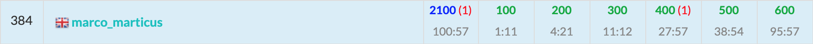

ABC191に参加しました. 結果は$6$完$384$位パフォーマンス$2027$.  
自身2回目の全完.  



以下, A~F問題の解説およびPython解答例です.


<adsense></adsense>


## A - Star 解説
「あといくつで100の倍数となるか？」という問題。  
他の問題でもよく使う考え方なので脊髄反射で書けるようにしたいところ。  

```python
print(100 - int(input()) % 100)

```

## B - uNrEaDaBlE sTrInG
`ord()`を使って`int型`で比較する。  
B問題にしてはコード量が多くなってしまった。  

```python
S = input()
a = ord('a')
z = ord('z')
A = ord('A')
Z = ord('Z')
isOK = True
for i, s in enumerate(S):
    if i % 2 == 0:
        isOK &= (a <= ord(s) <= z)
    elif i % 2 == 1:
        isOK &= (A <= ord(s) <= Z)
    else:
        isOK &= False
ans = 'Yes' if isOK else 'No'
print(ans)
```

`string.islower()`や`string.isupper()`を使うともっと簡潔に書ける。
```python
print('Yes' if all((i % 2) ^ s.islower() for i, s in enumerate(input())) else 'No')

```

<adsense></adsense>

## C - Kaprekar Number
定義通りに$g_1(x), g_2(x), f(x)$を順次計算していけばよい。  
おおよそ$\mathcal{O}(K\log N \log(\log N))$なので余裕で間に合う。

型変換を多用するのはかっこよくないし遅くなる原因だが、今回くらいの計算量ならまあいいでしょう。

```python
N, K = map(int, input().split())
a = N
for k in range(K):
    num = list(str(a))
    g1 = int(''.join(sorted(num, reverse=True)))
    g2 = int(''.join(sorted(num)))
    a = g1 - g2
print(a)

```

## D - Base n
二分探索で楽勝、と思いきや思わぬ落とし穴が。。。
ABC191に引き続き今回もD問題が鬼門(奇問)に。


- まず大前提として、問題は「条件を満たす値の**種類数**」であることがポイント。「条件を満たす進数表記の数」だと答えが無限大になる。  
- $X$が$1$桁の場合、どの進数表記においても値が同じになるため、  
$X \leq M \Rightarrow 1$  
$X > M \Rightarrow 0$  
となる。  
- $X$が$2$桁以上の場合、条件を満たす$n$進数表記の$n$の最大値を二分探索を使って求める。  
- ここで、二分探索の下限は$d + 1$ではなく$0$とするのがオススメである。下限は常に条件が成立することが求められるため。  
- $n$の最大値 を $N$ としたとき、答えは $max(0, N - d)$ となる。

```python
def solve(m):
    global X, M
    base = 1
    num = 0
    for x in X:
        num += x * base
        if num > M:
            return False
        base *= m
    return True


X = list(map(int, list(input())))
X.reverse()  # 逆順にしておくと、桁とindexが一致するため便利
M = int(input())
d = max(X)

if len(X) == 1:  # Xが1桁のときは答えは0 or 1
    print(1 if d <= M else 0)
    exit()

# 二分探索を使ってnの最大値を求める
ok = 0  # 下限を0にすることがポイント
ng = pow(10, 18) + 1
while abs(ok - ng) > 1:
    mid = (ok + ng) // 2
    if solve(mid):
        ok = mid
    else:
        ng = mid
print(max(0, ok - d))

```

<adsense></adsense>

## E - Train
ABC191に続いて比較的素直な最短経路問題。

- `ダイクストラ法`により都市$X$から都市$Y$への最短経路を求める。
- 移動可能な時刻が限定されている点に工夫が必要だが、結局は「どの都市でもできるだけ早く到着した方がいい」のと「都市に着いたら次に乗車可能な列車に乗った方がいい」という特徴により貪欲に求めていけばよいだけ。  
- 都市$i$に時刻$t_0$に到着したとき、鉄道$j$の次の発車時刻$t_1$は以下の式で求められる。  
$t_1 = t_0 + (K_j - t_0 \% K) \% K$  
$A$問題の発展系かな。

```python
import sys
from heapq import heappop, heappush


N, M, X, Y = map(int, input().split())
X -= 1; Y -= 1
edge = [[] for _ in range(N)]
for _ in range(M):
    a, b, t, k = map(int, sys.stdin.readline().split())
    a -= 1; b -= 1
    edge[a].append((b, t, k))
    edge[b].append((a, t, k))
path = [-1] * N
q = [(0, X)]  # (時刻, 都市)
while q:
    t, v = heappop(q)
    if path[v] == -1:
        path[v] = t
        if v == Y:
            break
        for nv, T, K in edge[v]:
            d = (K - (t % K)) % K
            nt = t + d + T
            heappush(q, (nt, nv))
print(path[Y])
```

<adsense></adsense>

## F - Potion
コンテスト中に通せて嬉しい。  
最初に$\mathcal{O}(N^3max(A_i))$の$dp$解法をすぐに思いついたけど、そこから悩みに悩んでなんとか正答まで辿り着いた。

考え方は以下。
- $V$種類の素材を合成したときに魔力が$X$に到達する時間$t$は以下の式となる。  
$\begin{aligned} & \sum_{i \in V}A_i + Vt &= &X　\\ \Leftrightarrow & t &= &\frac{X - \sum A_i}{V} \end{aligned} \cdots \text{①}$  
- $\text{①}$式が成立し、かつ$t$が最小となるには、  
$X - \sum_{i \in V}A_i \equiv 0 \pmod V$ を満たす$\sum_{i \in V}A_i$の最大値    
を見つければよい。  
- よって、$V = 1, \dots, N$について下記の$dp$を実行する。  
$dp[i][j][k] = i \text{番目まで見て,} j \text{種類選んだとき, } \sum A_i \equiv k \pmod V \text{となる, }\sum A_i \text{の最大値}$
- $dp[N][V][X \% V]$が答えの候補である。

$\mathcal{O}(10^8)$の$dp$はpythonにはかなり厳しそうだけど間に合ってよかった。

```python
N, X = map(int, input().split())
A = list(map(int, input().split()))

INF = pow(10, 12)
ans = pow(10, 18) + 1
for V in range(1, N + 1):  # V = 1, 2, ..., N についてdpを実行する
    dp = [[[-INF] * V for _ in range(V + 1)] for _ in range(N + 1)]
    dp[0][0][0] = 0
    for i in range(N):
        crt, nxt = dp[i], dp[i + 1]
        Ai = A[i]
        for j in range(V + 1):
            for k in range(V):
                here = crt[j][k]

                # Aiをまぜない
                nxt[j][k] = max(nxt[j][k], here)

                # Aiをまぜる
                nj = j + 1
                nk = (k + Ai) % V
                if nj <= V:
                    nxt[nj][nk] = max(nxt[nj][nk], here + Ai)
    cand = dp[N][V][X % V]
    if cand > 0:
        ans = min(ans, (X - cand) // V)
print(ans)

```

## まとめ
全完きもちいい！