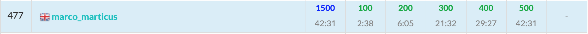

ABC194に参加しました. 結果は$5$完$477$位パフォーマンス$1845$!!.  
今回はA~C問題がいつもより難しくてびっくりしました.  



以下, A~F問題の解説およびPython解答例です.


<adsense></adsense>


## A - I Scream
問題文が難しすぎる...  
きちんと読めれば、題意のままに実装するだけ。

```python
A, B = map(int, input().split())
C = A + B
if C >= 15 and B >= 8:
    ans = 1
elif C >= 10 and B >= 3:
    ans = 2
elif C >= 3:
    ans = 3
else:
    ans = 4
print(ans)
```

## B - Job Assignment
仕事$A$と仕事$B$に割り当てる従業員の組み合せを全探索する。  
同一人物を割り当てたときは終了時間の算出式が変わる。

```python
N = int(input())
AB = [tuple(map(int, input().split())) for _ in range(N)]

ans = float('inf')
for i in range(N):
    ai, bi = AB[i]
    for j in range(N):
        aj, bj = AB[j]
        time = ai + bj if i == j else max(ai, bj)
        ans = min(ans, time)
print(ans)
```

<adsense></adsense>

## C - Squared Error
難しくてびっくりしちゃった。  
DやEよりも時間を要した。。

考え方は以下。
- $\{A_i\}$を左から順に見ていく。
- $C[n] = \text{既に登場した数値} $n$ \text{の個数}$ とすると、すべての$n$について$C[n] * (A_i - n)^2$ を計算すればよい。
- 計算量は、$A_i$が$V$種類存在するとき$\mathcal{O}(NV) \simeq 6 * 10^7$程度。

```python
from collections import Counter


N = int(input())
A = map(int, input().split())
C = Counter()
ans = 0
for a in A:
    for k, v in C.items():
        ans += v * ((k - a) ** 2)
    C[a] += 1
print(ans)
```

## D - Journey
確率漸化式の典型のような問題。  

- 連結成分数が$n$のときの期待値を$f_n$とおく。求めたいのは$f_1$であり、$f_N = 0$である。
- $n$個が連結しているとき、次の操作で連結済みの頂点が選ばれる確率を$P_S$、未連結の頂点が選ばれる確率を$P_T$とすると、これらは以下のように求められる。  
$P_S = \frac{n}{N}$  
$P_T = \frac{N - n}{N}$
- そして、$f_n$と$f_{n + 1}$の間には以下の漸化式が成り立つ。  
$f_n = (f_n + 1)P_S + (f_{n + 1} + 1)P_T  \cdots \text{①}$  
右辺第一項は連結済みの頂点を選んだ場合、第二項は未連結の頂点を選んだ場合である。
- $\text{①}$式を変形すると、以下の式となるため、$n = N - 1, \dots, 1$を順に計算していけばよい。  
$f_n = \frac{P_S + (f_{n+1} + 1)P_T}{1 - P_S}$

```python
N = int(input())
f = 0
for n in range(N - 1, 0, -1):
    Ps, Pt = n / N, (N - n) / N
    f = (Ps + (f + 1) * Pt) / (1 - Ps)
print(f)
```

<adsense></adsense>

## E - Mex Min
`Segment Tree`を利用して解いた。  
実行時間制限が$4sec$なんだね。。他にもっと厳しい問題があるので、そっちでも緩和お願いします。

- 数列$A$を左から順に見ていく。
- $B_i = \{A_i, A_{i + 1}, \dots , A_{i + M - 1}\}$とする。  
- まず、$mex(B_i)$を求めるには、以下の条件を満たす長さ$N$の数列$\{C_i\}$の要素の最小値を求めれば良い。  
数値$j$が$B_i$に存在するとき、$C_j = INF$  
存在しない時、　$C_j = j$  
(ただし, $INF = max(A) + 1$)
- Seg木を用いればこの問合せ処理は$\mathcal{O}(\log{N})$である。
- そして、$mex(B_{i + 1})$については、Seg木を更新すればよい。更新内容は$A_i$を削除・$A_{i + M}$
を追加である。削除については、`Counter`を利用して$B_{i+1}$中の要素数が$0$になるかどうかを管理する。


```python
from collections import Counter


class SegmentTree():
  """割愛
  """


N, M = map(int, input().split())
A = list(map(int, input().split()))
INF = max(A) + 1
C = Counter()  # C: {Ai, ..., A_i+M-1} に含まれる数値とその個数
st = SegmentTree([i for i in range(N)], min, INF)

# i = 0 での初期化処理
for i in range(M):
    a = A[i]
    C[a] += 1
    st.update(a, INF)  # 数値が存在するときは INF として更新
ans = st.get(0, N)  # i = 0 のときのmex
for i in range(1, N - M + 1):  # i = 1, ..., N-M+1 まで順に見ていく
    a_del = A[i - 1]  # a_del: 削除する数値
    C[a_del] -= 1
    if C[a_del] == 0:  # カウントが0のときのみseg木を更新
        st.update(a_del, a_del)
    a_add = A[i + M - 1]  # a_add: 追加する数値
    C[a_add] += 1
    if C[a_add] == 1:  # 新しく追加された場合のみseg木を更新。ちょっとした高速化。
        st.update(a_add, INF)
    ans = min(ans, st.get(0, N))
print(ans)
```

<adsense></adsense>

##　F - Digits Paradise in Hexadecimal
解説AC。  

`桁DP`は検討したけど、計算量を減らす工夫がまったく思いつかなかった。。。  
思いついたとしても、例外の考慮事項が多すぎて実装がかなり難しい。

```python
MOD = 10 ** 9 + 7
N, K = input().split()
K = int(K)
L = len(N)

'''
dp[i][j]: 以下の条件を全て満たす数値の数
    - N未満
    - 「上位0~i桁がすべて0」ではない
'''
dp = [[0] * (K + 1) for _ in range(L + 1)]
C = set()
for i, n in enumerate(N):
    crt, nxt = dp[i], dp[i + 1]
    n = int(n, 16)
    # dpテーブル内での遷移
    for j in range(K + 1):
        here = crt[j]
        # 既に登場したj種類の数字を使う場合
        nxt[j] += here * j
        nxt[j] %= MOD
        # これまでに登場していない数字を使う場合
        if j < K:
            nxt[j + 1] += here * (16 - j)
            nxt[j + 1] %= MOD
    # 「i - 1桁目 まで N と同じ」数値の考慮
    for j in range(i == 0, n):
        nj = len(C) + (j not in C)
        if nj <= K:
            nxt[nj] += 1
    # i - 1 桁目まで all 0 の数値の考慮
    if i > 0:
        nxt[1] += 15
    C.add(n)
cnt = dp[L][K]
cnt += (len(set(N)) == K)  # N自身の考慮
print(cnt % MOD)
```

## まとめ
早解きに助けられた！
