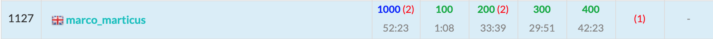

ABC195に参加しました. 結果は$4$完$1127$位パフォーマンス$1406$.  
難しかったですね。。 



以下, A~F問題の解説およびPython解答例です.


<adsense></adsense>


## A - Health M Death
やはりA問題はこれくらいシンプルじゃないと。

```python
M, H = map(int, input().split())
print('Yes' if H % M == 0 else 'No')
```

## B - Many Oranges
過去最難の$B$問題、ですよね？  
$W$がキログラムであることも地味に難易度を上げている。

```python
A, B, W = map(int, input().split())
W *= 1000
m, M = 1 << 32, 0
for i in range(pow(10, 6) + 1):
    if A * i <= W <= B * i:
        m = min(m, i)
        M = max(M, i)
if M > 0:
    print(m, M)
else:
    print('UNSATISFIABLE')
```

<adsense></adsense>

## C - Comma
難しくてびっくりしちゃった。

- 桁数ごとに存在する数の個数をカウントする。高々$15$桁なので十分に間に合う


```python
def f(k, N):
    '''N以下のk桁の数の個数を返す
    '''
    M = min(pow(10, k), N + 1)
    return M - pow(10, k - 1)


N = input()
L = len(N)
N = int(N)
ans = 0
for i in range(1, 6):  # コンマをi個持つとき
    for k in range(3 * i + 1, 3 * i + 4):  # その数は 3*i+1桁 ~ 3*i+3桁の数である
        if k <= L:  # 桁数はNの桁数以下でなければならない
            cnt = f(k, N)  # cnt: N以下のk桁の数の個数
            ans += cnt * i
print(ans)
```

## D - Shipping Center
難しそうな雰囲気を出しつつ、実は愚直に実装するだけで解ける問題。  
計算量の見積り力が問われる問題かな？


- **価値の大きな荷物**から順に、使える箱のなかで**大きさ最小の箱**に入れる。

```python
import sys
from operator import itemgetter


N, M, Q = map(int, input().split())
WV = [tuple(map(int, sys.stdin.readline().split())) for _ in range(N)]
X = list(map(int, input().split()))
query = [tuple(map(int, sys.stdin.readline().split())) for _ in range(Q)]

WV.sort(key=itemgetter(1), reverse=True)  # 荷物を価値の大きな順にソートしておく

for L, R in query:
    L -= 1; R -= 1
    box = sorted(X[:L] + X[R + 1:])  # box: 使える箱。小さい順にソートする
    done = [1] * len(box)  # done[i]: i番目の箱が使えるかどうか
    ans = 0
    for w, v in WV:
        for i, x in enumerate(box):  # 大きさの小さい箱から順に格納可能かをチェックする
            if done[i] and w <= x:
                done[i] = 0
                ans += v
                break
    print(ans)
```

<adsense></adsense>

## E - Lucky 7 Battle
解説AC。

- $n$ラウンド目が終了したときの数$T$を$7$で割った余りを$r_{n}$とする。
- $n$ラウンド目がTakahashi君の手番のとき、Takahashi君は$10r_{n-1}$ もしくは $10r_{n-1} + S_n$ を選び、$r_n$を自分の有利な数にしようと試みる。
- 一方で、手番がAoki君のとき、Aoki君は$r_n$がTakahashi君の不利な数になるように選ぶ。しかし $10r_{n-1}$ と $10r_{n-1} + S_n$ のどちらを選んでも最終的にTakahashi君が勝つときは、どうしようもない。(これを**どうしようもない操作**とでも呼ぼう)。
- したがって、**Takahashi君の作為的な操作**と**Aoki君のどうしようもない操作**のみで$7$の倍数を作ることができればTakahashi君の勝ち、そうでなければAoki君の勝ちである。


```python
N = int(input())
S = list(map(int, input()))
X = input()
MOD = 7
dp = [[0] * MOD for _ in range(N + 1)]  # dp[i][r]: iラウンド目が終了時点で余りrのときTakahshi君は勝てるか？
dp[N][0] = 1  # 全ラウンド終了時点でr=0であればTakahashi君の勝ち
for i in range(N - 1, -1, -1):
    s = S[i]
    if X[i] == 'T':  # Takahashi君の手番のとき
        for j in range(MOD):
            J = (j * 10) % MOD
            dp[i][j] = (dp[i + 1][J] | dp[i + 1][(J + s) % MOD])  # どちらかでも勝てればよい
    else:  # Aoki君の手番のとき
        for j in range(MOD):
            J = (j * 10) % MOD
            dp[i][j] = (dp[i + 1][J] & dp[i + 1][(J + s) % MOD])  # どうしようもない操作のときのみTakahashi君の勝ち
print('Takahashi' if dp[0][0] else 'Aoki')
```

<adsense></adsense>

##　F - Coprime Present
解説AC。  

解き方の検討すらつかなかった。。  
$gcd(n, m) <= A - B <= 72$ という制約に気付けるかどうか。  


まず、基本的な考察は以下。
- まず、$\text{「どの相違なる2枚についても互いに素」} \Leftrightarrow \text{「どの相違なる2枚についても共通する素因数を持たない」} \cdots \text{①}$ と言い換えられる。
- したがって、共通する素因数を持たないようにカードを選んでいけばよい。  
- ここで $A - B \leq 72$ より、**共通し得る素因数は$72$以下の素数のみ**である。$72$より大きい素数は無視してよい。  
(なぜなら、例えば$73$を共通の素因数に持つ二つの異なる数の差は必ず$73$以上となるためである。)
- $72$以下の素数は$20$個しか存在しないため、状態数は高々$2^{20} \simeq 10^6$である。`bitDP`により解くことができる。

以下、具体的な`bitDP`での解き方。
- $P_k=k\text{番目の素数}$とする。($0$-index、つまり$P_0=2$とする。)
- $num_i = \text{「}A+i \text{が}k\text{番目の素数を因数にもつかどうかを表すbit集合」}$とする。  
例) $2, 5$を素因数に持つ $\rightarrow num_i = 101_{(2)}$
- $dp(i, bit) = i\text{番目までのカードを見たとき, 既に選んだカードに含まれる素因数の状態が} bit となっている場合の数$ とする。
- $dp$の遷移は、以下のとおり。  
$\begin{aligned} dp(i, bit) &= dp(i - 1, bit) &\cdots \text{(i番目のカードを選ばない)}\\ &+ dp(i - 1, bit - num_i) &\cdots \text{(i番目のカードを選ぶ. } num_i \subseteq bit \text{のときのみ.)} \end{aligned}$


```python
A, B = map(int, input().split())
# primes[k]: k番目の素数
primes = [2, 3, 5, 7, 11, 13, 17, 19, 23, 29, 31, 37, 41, 43, 47, 53, 59, 61, 67, 71]
L = len(primes)
N = B - A + 1  # N: カードの数

# num[i]: i番目のカードがk番目の素数をもつとき num[i] |= (1 << k)
num = [0] * N
for i in range(N):
    num[i] = sum((1 << j) for j in range(L) if (A + i) % primes[j] == 0)

# dp配列を使いまわす実装
dp = [0] * (1 << L)
dp[0] = 1
for i, n in enumerate(num):
    for bit in range((1 << L) - 1, -1, -1):  # dp配列を使いまわすためbitの大きい方から計算する
        if (bit & n) == n:  # n が bit に含まれるとき
            dp[bit] += dp[bit ^ n]
print(sum(dp))

```

## まとめ
爆死しなくてよかったー
