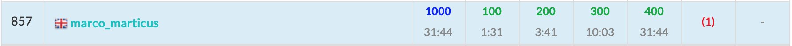

ABC196に参加しました. 結果は$4$完$857$位パフォーマンス$1573$.  
実力相応の結果でした.  



以下, A~E問題の解説およびPython解答例です.


<adsense></adsense>


## A - Difference Max
（コンテストではひよって全探索しました。）

```python
a, b = map(int, input().split())
c, d = map(int, input().split())
print(b - c)
```

## B - Round Down
`index()`メソッドを使う。

```python
X = input()
if '.' in X:
    print(X[:X.index('.')])
else:
    print(X)
```

<adsense></adsense>

## C - Doubled
なんか複雑な解き方をしてしまった。  
公式解説のようにシンプルに解きたかった。


```python
N = int(input())
L = len(str(N))

cnt = 0
for K in range(2, L + 1, 2):  # K: 桁数。偶数桁のみ。
    k = K // 2  # k: 前半部分の桁数
    base = pow(10, k)  # base: 前半部分の位
    for i in range(base // 10, base):  # k桁の数を全列挙する
        if i * base + i <= N:
            cnt += 1
print(cnt)
```

## D - Hanjo
とっつきにくい問題だが、DFSで全探索するだけ。  
`bitDP`の一種かな。

- 左上から右方向に順に敷き詰めていく。
- 現在いるマスにまだ敷かれていないとき、敷き方は３通りある: 「$B$を敷く」「$A$を横方向に敷く」「$A$を縦方法に敷く」
- 各マスに敷かれているかどうかはビット列で状態管理する。


```python
import sys
sys.setrecursionlimit(10 ** 6)


def dfs(i, bit, a, b):
    '''
    i: 現在位置
    bit: 畳の敷設状態を示すビット列
    a, b: 畳の残り枚数
    '''
    ret = 0  # ret: 現在マス以降の敷き方の総数
    h, w = divmod(i, W)  # h, w: 現在マスはh列w行
    if i == H * W:  # 全マスに敷き終わった場合
        ret = 1
    elif (bit >> i) & 1:  # 現在マスが既に敷設済の場合
        ret += dfs(i + 1, bit, a, b)  # 何もせず次のマスに移動
    else:  # 現在マスの畳の敷き方
        # Bを敷く場合
        if b > 0:
            nbit = bit | (1 << i)
            ret += dfs(i + 1, bit, a, b - 1)
        # Aを横向きに敷く
        if a > 0 and w < W - 1 and not (bit >> (i + 1)) & 1:
            # 横のマス(i + 1)が空いているときのみ可能
            nbit = bit | (1 << i) | (1 << (i + 1))
            ret += dfs(i + 1, nbit, a - 1, b)
        # Aを縦向きに敷く
        if a > 0 and h < H - 1 and not (bit >> (i + W)) & 1:
            # 下のマス(i + W)が空いているときのみ可能
            nbit = bit | (1 << i) | (1 << (i + W))
            ret += dfs(i + 1, nbit, a - 1, b)
    return ret


H, W, A, B = map(int, input().split())
N = H * W
ans = dfs(0, 0, A, B)
print(ans)
```

<adsense></adsense>

## E - Filters
解けなかった。。おしくもなかった。。残念。。

- $g(x) = f_N(\dots f_2(f_1(x))\dots)$ とする
- サンプルケースなどで$x$の値を動かしてみれば、$g(x)$が ＿／￣ という形になることが予想できる。
- これは、一定以上および以下の$x$では定数値となるということである。
- $g(\infty)$と$g(-\infty)$を求めれば、上下の定数値がわかる。


```python
N = int(input())
A = [0] * N
T = [0] * N
for i in range(N):
    a, t = map(int, input().split())
    A[i], T[i] = a, t
Q = int(input())
X = list(map(int, input().split()))

S = 0  # ti = 1 の ai の合計
INF = float('inf')
m, M = -INF, INF  # m: -∞, M: ∞
for i in range(N):  # fi(x)を順に適用していく
    a, t = A[i], T[i]
    if t == 1:
        S += a
        m += a
        M += a
    elif t == 2:
        m = max(m, a)
        M = max(M, a)
    else:
        m = min(m, a)
        M = min(M, a)

for x in X:
    if x + S < m:
        print(m)
    elif m <= x + S <= M:
        print(x + S)
    else:
        print(M)
```

<adsense></adsense>

##　F - Coprime Present
TBA

## まとめ
うーん、我慢。
