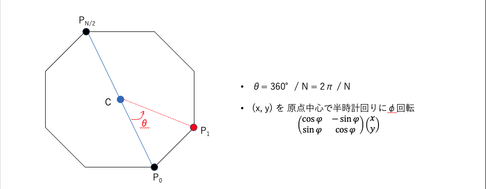

ABC197に参加しました. 結果は$5$完$575$位パフォーマンス$1730$.  
なかなかいい感じ。


以下, A~F問題の解説およびPython解答例です.


<adsense></adsense>


## A - Rotate 解説
スライスを使う。

```python
S = input()
ans = S[1:] + S[0]
print(ans)
```

## B - Visibility
B問題にしては難しい。  
マス$(X, Y)$から$4$方向にそれぞれ`DFS`を実施し、通ったマスの数を数える。

```python
import sys
sys.setrecursionlimit(10 ** 6)


def dfs(x, y, d):
    x, y = v
    dx, dy = D[d]
    nx, ny = x + dx, y + dy
    if 0 <= nx < H and 0 <= ny < W and S[nx][ny] == '.' and path[nx][ny] == 0:
        path[nx][ny] = 1
        dfs((nx, ny), d)


H, W, X, Y = map(int, input().split())
X -= 1; Y -= 1
S = [input() for _ in range(H)]
path = [[0] * W for _ in range(H)]  # path[i][j]: マス(i, j)を通ったかどうか
path[X][Y] = 1
D = [(1, 0), (-1, 0), (0, 1), (0, -1)]  # D[]: 移動方向を定義
for i in range(4):
    dfs((X, Y), i)

ans = 0
for i in range(H):
    for j in range(W):
        ans += path[i][j]
print(ans)
```

<adsense></adsense>

## C - ORXOR
C問題で`OR`や`XOR`が問われるのは珍しいような。

区切り位置を`bit全探索`する。


```python
from itertools import product

N = int(input())
A = list(map(int, input().split()))
ans = float('inf')
for bit in product(range(2), repeat=N):  # 区切り位置を表すbit列
    if bit[-1] == 1:  # 末尾の区切りは必ず1
        xor = 0  # xor: 全体のXORの値
        sec = 0  # sec: 当該区画のORの値
        for i, a in enumerate(A):
            sec |= a  # ビット単位ORを求める
            if bit[i] == 1:  # 区画の終端の場合は、xorを更新し、secを初期化
                xor ^= sec
                sec = 0
        ans = min(ans, xor)
print(ans)
```

## D - Opposite
$P_0, P_{\frac{N}{2}}$が与えられているため、正多角形の外接円の中心$C$の座標がわかる。  
これを利用して$C$を中心に$p_0$を$\frac{2\pi}{N}$回転させればよい。



```python
from math import sin, cos, pi

N = int(input())
x0, y0 = map(int, input().split())  # P0
x2, y2 = map(int, input().split())


theta = 2 * pi / N  # theta: 回転させる角度（ラジアン）
Cx, Cy = (x0 + x2) / 2, (y0 + y2) / 2  # (Cx, Cy): 外接円の中心

xa, ya = x0 - Cx, y0 - Cy  # 点Cを原点に並行移動した時のP0の座標
xb, yb = xa * cos(theta) - ya * sin(theta), xa * sin(theta) + ya * cos(theta)  # (xa, ya)をθ回転
x1, y1 = xb + Cx, yb + Cy  # 原点から点Cへと並行移動
print(x1, y1)

```

<adsense></adsense>

## E - Traveler
考察は易しいが実装が難しい問題。

考え方は以下。
- 色が小さいものから順に回収していく。
- 色$i$のものに注目すると、下記の2つのルートのどちらかが最適となる:  
**ルート1**: 現在地 → 左端 → 右端  
**ルート2**: 現在地 → 右端 → 左端
- よって各色$i$回収後に、左端・右端のそれぞれにいる場合の最小コスト・座標を管理して、次の色$i+1$の場合を考えればよい。


```python
import sys

N = int(input())
ball = [[] for _ in range(N + 1)]  # ball[i]: 色iのボールの座標
for _ in range(N):
    X, C = map(int, sys.stdin.readline().split())
    C -= 1
    ball[C].append(X)
ball[N].append(0)  # 最後に座標0に戻るため、番兵として座標0のものを入れておく
for i in range(N + 1):  # 各色ごとに座標をソートする
    ball[i].sort()


INF = float('inf')

# dp[i][j]: 色iまで回収したときの最小値(左端時: j = 0, 右端時: r = 1)
dp = [[INF] * 2 for _ in range(N + 2)]  
dp[0][0] = dp[0][1] = 0


# pos[i][j]: 色iまで回収したときの現在地(左端時: j = 0, 右端時: r = 1)
pos = [[None] * 2 for _ in range(N + 2)]
pos[0][0] = pos[0][1] = 0

L, R = 0, -1  # L, R: dp配列やballにおける左端、右端を表すindex
for i in range(N + 1):
    if ball[i]:  # ボールが存在するとき
        for j in [L, R]:  # j: 現在地が左端 or 右端
            crt_cost = dp[i][j] # crt_cost: 現在値での経過時間
            crt_pos = pos[i][j]  # crt_pos: 現在地の座標

            # first, second: 回収する順番を全探索。左端→右端 or 右端→左端
            for first, second in [[L, R], [R, L]]:
                nxt_cost = crt_cost
                nxt_cost += abs(crt_pos - ball[i][first])
                nxt_cost += abs(ball[i][first] - ball[i][second])
                if nxt_cost < dp[i + 1][second]:
                    dp[i + 1][second] = nxt_cost
                    pos[i + 1][second] = ball[i][second]

    else:  # ボールが存在しないとき、単純にコピーする。参照渡しでOK。
        dp[i + 1] = dp[i]
        pos[i + 1] = pos[i]
print(min(dp[N + 1]))
```

<adsense></adsense>

##　F - Construct a Palindrome
解説AC。  
うーん、これは難しい。思いつかない。。


考え方は以下。
- 便宜上、回文を先頭から末尾に向かう駒を$L$、末尾から先頭に向かう駒を$R$とする。
- 駒$L$は頂点$0$からスタートし、駒$R$は頂点$N - 1$からスタートする。
- 駒$L$と$R$は、ぞれぞれの現在地点から同じ文字の辺が出ているとき、その辺を通って次の頂点に同時に移動する。
- $(L\text{の現在地}, R\text{の現在地})$とすると、例えばSample1のケースではスタートから1手目は以下のような移動を行う。  
$(1, 8) \rightarrow (2, 7)$
- この$(L\text{の現在地}, R\text{の現在地})$の組を頂点とみなした新たなグラフを考え、$(1, N)$から出発した場合の各頂点への最短距離を求めればよい。
- $(i, i)$の頂点が偶数長の回文、$(i, j) (\text{ただし}dist(i, j) = 1)$の頂点が奇数長の回文に対応する。

```python
import sys
from collections import deque


N, M = map(int, input().split())
E = [[] for _ in range(26)]  # E[c]: 文字cの有効辺
one = set()  # one: 最短距離が1の頂点の組の集合。最後に答えを求めるときに使う。
for _ in range(M):
    a, b, c = sys.stdin.readline().split()
    a, b = int(a) - 1, int(b) - 1
    c = ord(c) - 97  # ord('a') -> 97
    E[c].add((a, b))
    if a != b:
        E[c].add((b, a))
        one.add((a, b))
        one.add((b, a))

#以下、 頂点(i, j) を i * N + j に対応させる。1次元配列にして高速化を図る。
edge = [[] for _ in range(N ** 2)]
for c in range(26):
    e = E[c]
    for a, b in e:
        for c, d in e:
            # a -> b および c -> d の辺が存在するとき, (a, c) -> (b, d) の移動が可能
            v = a * N + c
            nv = b * N + d
            edge[v].append(nv)


# BFSによりスタート地点からの最短距離を求める。
INF = float('inf')
path = [INF] * (N ** 2)
q = deque()
v0 = 0 * N + (N - 1)  # v0: スタート地点 (0, N - 1)
path[v0] = 0
q.append((v0, 0))
while q:
    v, c = q.popleft()
    nc = c + 1
    for nv in edge[v]:
        if path[nv] > nc:
            path[nv] = nc
            q.append((nv, nc))

ans = float('inf')
for k in range(N ** 2):
    i, j = divmod(k, N)
    if i == j:  # 偶数長の回文
        ans = min(ans, path[k] * 2)
    elif (i, j) in one:  # 奇数長の回文
        ans = min(ans, path[k] * 2 + 1)
print(-1 if ans > pow(10, 10) else ans)
```

## まとめ
青変はおあずけ。。
