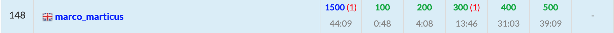

ABC198に参加しました. 結果は$5$完$148$位パフォーマンス$2257$.  
ついに青色になりました！！！！！！



以下, A~F問題の解説およびPython解答例です.


<adsense></adsense>


## A - Div
良い。A問題はこうでなくては。

```python
print(int(input()) - 1)
```

## B - Palindrome with leading zeros
Nの末尾の$0$を消して残った部分が回文になっているかどうかを判定する。

```python
N = list(input())

while N and N[-1] == '0':  # 末尾の0を削除
    N.pop()

L = len(N)  # L: Nの残りの部分の長さ
print('Yes' if all(N[i] == N[L - 1 - i] for i in range(L // 2)) else 'No')
```

<adsense></adsense>

## C - Compass Walking
点$(X, Y)$が原点に近いときの考慮を忘れて1WA。。もったいなかった。

初期位置が原点に近い場合以外は、$kR \geq \sqrt{X^2 + Y^2}$を満たす最小の整数$k$が答え。  
誤差が怖いので、$k^2R^2 \geq X^2 + Y^2$を利用した。

```python
R, X, Y = map(int, input().split())
L2 = pow(X, 2) + pow(Y, 2)
R2 = pow(R, 2)
if R2 == L2:  # 1歩で到達できる場合
    print(1)
elif R2 > L2:  # 1歩分よりも距離が近い場合
    print(2)
else:
    for k in range(10 ** 7):
        if pow(k, 2) * R2 >= L2:
            print(k)
            break
```

## D - Send More Money
$10!$の問題って初めて見た気がする。大体いつも$8!$が多いような。  


$11$種類以上文字が登場した場合は、UNRESOLVABLE。  
$10$種類以下の文字について、数字の対応を全パターン試す。最大で$\mathcal{O}(10!)$となり間に合う。  

`pypy3`でギリギリ4.5sくらい。

```python
from itertools import permutations


def StoL(S, num):
    # 文字列Sをnum[c]対応表にしたがって数値に変換する
    ret = 0
    for s in S:
        ret *= 10
        ret += num[s]
    return ret


S1, S2, S3 = input(), input(), input()
S = list(set(S1) | set(S2) | set(S3))  # S: S1~S3に登場する文字
nonzero = set([S1[0], S2[0], S3[0]])  # nonzero: S1~S3の先頭は0とはなり得ない
L = len(S)  # L: 文字の種類数

# 以下、itertools.permutationsにより0~9の数字をL種類の文字に当てはめた全パターンを求める。
# permutations(n, r) は n < r のとき1回もiterateせずにfor文を抜ける。
for P in permutations(range(10), L):
    num = {}  # num[c]: 文字cに対応する数字
    for i, p in enumerate(P):
        num[S[i]] = p
    if any(num[z] == 0 for z in nonzero):  # S1~S3の先頭文字が0だった場合はスキップ
        continue
    else:
        s1 = StoL(S1, num)
        s2 = StoL(S2, num)
        s3 = StoL(S3, num)
        if s1 + s2 == s3:
            print(s1)
            print(s2)
            print(s3)
            exit()
print('UNSOLVABLE')
```

<adsense></adsense>

## E - Unique Color
かなり簡単だったように思う。  
問題文を読んでノータイムで解法が浮かんだ。

`collections.Counter`を使って通ってきた経路上の頂点の色とその個数を保持する。  
その頂点に入ったときに$+1$、親に戻る時に$-1$するだけ。

```python
import sys
from collections import Counter
sys.setrecursionlimit(10 ** 6)


def dfs(v, done):
    c = C[v]  # c: その頂点の色
    if done[c] == 0:  # 経路上にその色が存在しなければ答えに加える
        ans.append(v + 1)
    done[c] += 1  # 頂点に入る時に+1する
    for nv in edge[v]:
        if path[nv] == 0:
            path[nv] = 1
            dfs(nv, done)
    done[c] -= 1  # 頂点から抜ける時(=親に戻る時)に−1する


N = int(input())
C = list(map(int, input().split()))
edge = [[] for _ in range(N)]
for _ in range(N - 1):
    A, B = map(int, sys.stdin.readline().split())
    A -= 1; B -= 1
    edge[A].append(B)
    edge[B].append(A)

done = Counter()  # done[c]: 経路上の色cの頂点の数
ans = []
path = [0] * N  # path[v]: 頂点vを既に通ったかどうか
path[0] = 1
dfs(0, done)

ans.sort()
print(*ans, sep='\n')
```

<adsense></adsense>

## F - Cube
TBA


## まとめ
苦節1年、やっと青になった！！嬉しい！！
