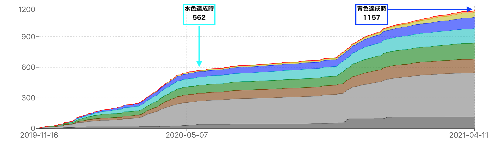

先日のABC198にて黄パフォを得て、ついに念願の青色になることができました！！  
青変記事を残します。

<adsense></adsense>

## ここまでの軌跡を振り返る
### 水色になるまで6ヶ月、青色までさらに1年
2019年11月にAtCoderを始め、約6ヶ月で水色、その後さらに1年を費やし青色になりました。長かった。。

### 過去問AC数は1157
過去問AC数は、水色達成時点で**562AC**、青色達成時点で**1157AC**でした。  
水色に突入以降消化スピードが鈍化しましたが、これはおそらく難しい問題に取り組むことが増えたためと思われます。。

### 使用言語はPython
使用言語はPythonです。ほとんどPypyで提出してました。  
極稀にPythonの速度に涙を呑むことがありましたが、それ以上にint型やDecimal型の柔軟さの恩恵にあずかったように思います。

<adsense></adsense>

## 練習方法に関する持論

### 精進は基礎トレと実践トレを交互に
蟻本などの教材をやるべきか、過去問を解きまくるべきか。  
私の持論は「**両方をバランスよくやりましょう**」ですね。 蟻本 → 過去問 → 蟻本 → ... と一定期間(例えば1ヶ月)ごとに交代しながら進めるのが良いと思っています。

**蟻本やWeb記事でアルゴリズムや数学の知識を増やす練習方法はスポーツで言うと基礎トレ**（走り込み、筋トレ、素振り）みたいなものです。 必要な筋肉を鍛え、動作を体に染み込ませる。これは非常に大切な練習ですが、**レートには反映されにくい**です。実際、自分も蟻本を集中的にやっていた時期はレートが伸びず、逆に下がってしまうこともありました。「知識は確実に増えているのに、コンテストの問題は解けない」という辛い状態に陥るかもしれませんが、冬期の基礎トレと割り切って鍛錬に集中しましょう。  

一方で、**過去問をひたすら解くという練習方法はいわば実践トレーニング**（対人トレーニング、練習試合）です。実戦に近い形で現時点での自分の能力を試す。基礎トレで培ったモノをどう活かせば良いのか、何をすれば試合に勝てるのか(=解けるのか)、色々な気づきが得られます。この練習方法は**レートの伸びに直結する**印象を持っています。累積AC数と比例するようにレートが伸びます。しかし、ある時点で伸びが鈍化し頭打ちするんですね。もう一段高いところに行くには、一旦基礎トレに戻ってベースラインを上げなければならないわけです。  

### 解説AC推奨、公式解説動画もオススメ
解説を見るべきか、自力で考察を見るべきか。  
私の場合は**わからない問題は1時間ほど考えてからすぐに解説を見ていました**。

ABCレベルの問題はいわゆる"典型"が多く、有名アルゴリズムを扱う問題 or 既出問題の類題 と呼べる問題ばかりです。時間を費やして考察力を鍛えるよりも、とにかく典型知識を増やしたほうが、コンテストで問題を解ける可能性は上がります。

解説を見る場合は、ぜひ**公式解説動画も参照することをお勧めします**。書面解説には載っていない考え方・思考のヒントを紹介してくれたり、解法に至る思考をトレースすることができます。

<adsense></adsense>

## 今後
水色6ヶ月、青色1年、となると黄色は2年でしょうか。  
自分の数学力を鑑みると、生半可な努力では黄色に辿り着けそうもない。。ちょっと一休みして、黄色を目指すかどうか考えようかな。  

とりあえず青色になれただけでもうれしー！